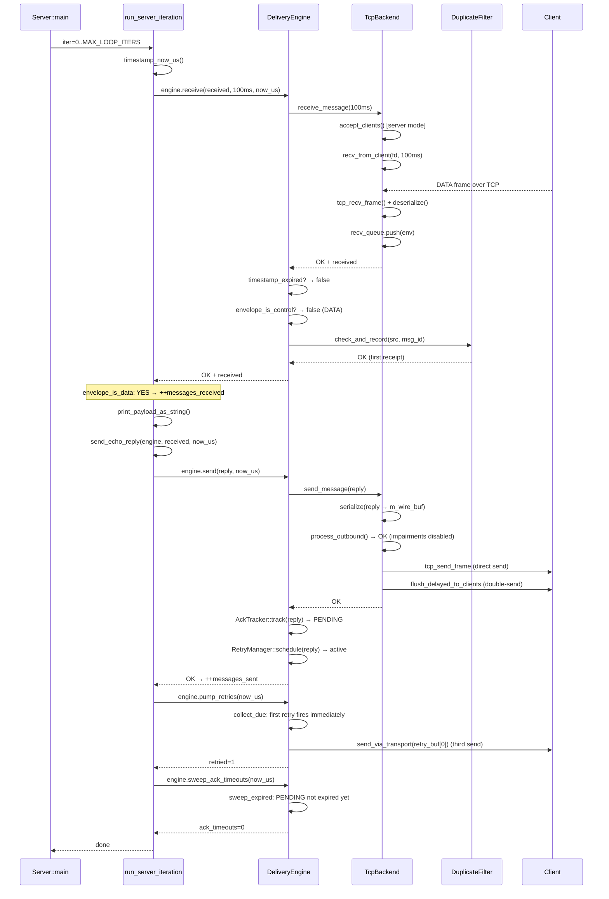

# UC_05 — Server Echo Reply

**HL Group:** Application Workflow — combines HL-5 (receive) then HL-1/2/3 (send); spans both receive and send system boundaries
**Actor:** User/Application (Server process)
**Requirement traceability:** REQ-3.1, REQ-3.2.1, REQ-3.2.2, REQ-3.2.4, REQ-3.2.5, REQ-3.2.6, REQ-3.3.2, REQ-3.3.3, REQ-4.1.2, REQ-4.1.3, REQ-7.1.1, REQ-7.1.2

---

## 1. Use Case Overview

UC_05 is an **Application Workflow** pattern, not a single User→System interaction. It documents how the Server application (src/app/Server.cpp) combines two system calls — HL-5 receive and HL-1/2/3 send — into an echo loop. The User never calls this pattern directly; it is the behavior of the Server binary.

**Trigger:** The Server's main loop iteration begins. `run_server_iteration()` is called from the outer `for` loop in `main()` (Server.cpp:261). The loop is bounded by `MAX_LOOP_ITERS = 100000` and terminates early when `g_stop_flag != 0` (set by SIGINT handler).

**Expected outcome:** If a DATA message is present, the server receives it, logs metadata, swaps source and destination identifiers, copies the payload into a reply envelope, sends the reply, and increments `messages_received` and `messages_sent`. On timeout (no message), only `pump_retries()` and `sweep_ack_timeouts()` run; no echo is sent.

**Why this is factored as an Application Workflow:** The echo pattern sits entirely above the system boundary. It depends on two separate system capabilities (HL-5 receive, then HL-1/2/3 send) and on application-level policy (swap src/dst, set 10-second expiry, copy payload). The system itself has no "echo" concept; only the application layer does.

---

## 2. Entry Points

| Entry point | File | Line |
|-------------|------|------|
| `Server::main()` | `src/app/Server.cpp` | 196 |
| Outer loop iteration | `src/app/Server.cpp` | 261 |
| `run_server_iteration()` | `src/app/Server.cpp` | 152 |
| `send_echo_reply()` | `src/app/Server.cpp` | 90 |

The application also relies on:

| Component | File |
|-----------|------|
| `DeliveryEngine::receive()` | `src/core/DeliveryEngine.cpp:149` |
| `DeliveryEngine::send()` | `src/core/DeliveryEngine.cpp:77` |
| `TcpBackend::receive_message()` | `src/platform/TcpBackend.cpp:386` |
| `TcpBackend::send_message()` | `src/platform/TcpBackend.cpp:347` |

---

## 3. End-to-End Control Flow (Step-by-Step)

### Phase A: Server Initialization (runs once at startup)

A1. `main()` (Server.cpp:196): `parse_server_port(argc, argv)` → `bind_port = 9000` (default).
A2. `transport_config_default(cfg)`: zero-fills `TransportConfig`.
A3. Set fields (Server.cpp:210–218):
    - `cfg.kind = TransportKind::TCP`, `cfg.is_server = true`, `cfg.bind_port = 9000`
    - `cfg.local_node_id = LOCAL_SERVER_NODE_ID = 1U`, `cfg.num_channels = 1U`
    - `strncpy(cfg.bind_ip, "0.0.0.0", ...)` with explicit null-termination
A4. Channel setup (Server.cpp:221–225):
    - `channel_config_default(cfg.channels[0], 0U)` — sets `retry_backoff_ms = 100`, etc.
    - `reliability = RELIABLE_RETRY`, `ordering = ORDERED`, `max_retries = 3U`, `recv_timeout_ms = 100U`
A5. `TcpBackend transport; transport.init(cfg)`:
    - `m_recv_queue.init()`, `impairment_config_default(imp_cfg)` (disabled), `m_impairment.init(imp_cfg)`
    - `m_is_server = true`
    - `bind_and_listen("0.0.0.0", 9000)`: `socket_create_tcp()`, `socket_set_reuseaddr()`, `socket_bind()`, `socket_listen(m_listen_fd, 8)`, `m_open = true`
A6. `DeliveryEngine engine; engine.init(&transport, cfg.channels[0], 1)`:
    - `AckTracker::init()`, `RetryManager::init()`, `DuplicateFilter::init()`
    - `m_id_gen.init(seed=1)` — `m_next = 1ULL`
    - `m_initialized = true`
A7. `signal(SIGINT, signal_handler)` — installs stop mechanism. MISRA deviation documented at line 249: `signal()` requires a function pointer; no alternative POSIX API is available.

### Phase B: Main Loop

B1. `for (int iter = 0; iter < 100000; ++iter)` (Server.cpp:261):
    - If `g_stop_flag != 0`: log "Stop flag set; exiting loop"; `break`.
    - Call `run_server_iteration(engine, messages_received, messages_sent)`.

### Phase C: run_server_iteration() — Receive Attempt

C1. `run_server_iteration()` (Server.cpp:152):
    - `NEVER_COMPILED_OUT_ASSERT(RECV_TIMEOUT_MS > 0)` and `NEVER_COMPILED_OUT_ASSERT(messages_sent <= messages_received + 1U)`.
    - `now_us = timestamp_now_us()` — calls `clock_gettime(CLOCK_MONOTONIC)`.

C2. `engine.receive(received, 100U, now_us)` (Server.cpp:164):
    - `DeliveryEngine::receive()` calls `m_transport->receive_message(received, 100)`.
    - `TcpBackend::receive_message()` runs the poll loop: fast-path `pop()`, then up to 1 iteration of `poll_clients_once(100U)` (ceiling of 100/100 = 1, capped at 50).
    - `poll_clients_once()` calls `accept_clients()` (server mode), then iterates `m_client_fds[0..7]` calling `recv_from_client(fd, 100U)` for each active fd.
    - `recv_from_client()` calls `tcp_recv_frame()` → `socket_recv_exact()` (poll + recv loop for 4-byte header, then for payload) → `Serializer::deserialize()` → `m_recv_queue.push()`.
    - After `poll_clients_once()`: `m_recv_queue.pop()`, then `flush_delayed_to_queue(now_us2)`, then `m_recv_queue.pop()` again.
    - Returns `OK` with envelope populated, or `ERR_TIMEOUT` if no message arrived.
    - `DeliveryEngine` then checks: `timestamp_expired()` (drop if stale), `envelope_is_control()` (drop if ACK/NAK/HEARTBEAT), dedup via `DuplicateFilter::check_and_record()` for `RELIABLE_RETRY` messages.

C3. Result check (Server.cpp:166): `if (result_ok(res) && envelope_is_data(received))`:
    - `++messages_received`
    - `Logger::log(INFO, "Server", "Received msg#N from node M, len L:")`
    - `print_payload_as_string(received.payload, received.payload_length)` — `snprintf()` into a 256-byte stack buffer, then `printf`.
    - `send_echo_reply(engine, received, now_us)`

C4. If `res == ERR_TIMEOUT`: no echo sent. `pump_retries()` and `sweep_ack_timeouts()` still run below.

### Phase D: send_echo_reply()

D1. `send_echo_reply(engine, received, now_us)` (Server.cpp:90):
    - `NEVER_COMPILED_OUT_ASSERT(envelope_valid(received))` and `NEVER_COMPILED_OUT_ASSERT(now_us > 0U)`.
    - `envelope_init(reply)` — `memset` to 0, `message_type = INVALID`.
    - Build echo reply:
      - `reply.message_type = MessageType::DATA`
      - `reply.source_id = received.destination_id` (server node id = 1)
      - `reply.destination_id = received.source_id` (client node id = 2)
      - `reply.priority = received.priority` (= 0)
      - `reply.reliability_class = received.reliability_class` (= `RELIABLE_RETRY`)
      - `reply.timestamp_us = now_us`
      - `reply.expiry_time_us = timestamp_deadline_us(now_us, 10000U)` = `now_us + 10,000,000 µs`
      - `reply.payload_length = received.payload_length`
    - Bounds check: if `reply.payload_length > MSG_MAX_PAYLOAD_BYTES (4096)` → return `ERR_INVALID`.
    - `memcpy(reply.payload, received.payload, reply.payload_length)`

D2. `engine.send(reply, now_us)` (DeliveryEngine.cpp:77):
    - Stamps: `reply.source_id = m_local_id = 1` (same value, no visible change), `reply.message_id = m_id_gen.next()` (overwrites any pre-set value), `reply.timestamp_us = now_us`.
    - `send_via_transport(reply)` → `TcpBackend::send_message(reply)`:
      - `Serializer::serialize()` → 44-byte header + payload into `m_wire_buf`.
      - `timestamp_now_us()` → `now_us2`.
      - `m_impairment.process_outbound(reply, now_us2)` — impairments disabled; queues with `release_us = now_us2` (immediate).
      - `send_to_all_clients(m_wire_buf, wire_len)` → `tcp_send_frame()` per connected fd.
      - `flush_delayed_to_clients(now_us2)` — drains delay buffer; re-serializes and sends queued message (double-send; see Risk 1).
    - `AckTracker::track(reply, ack_deadline)` — `ack_deadline = now_us + 100ms`; slot transitions FREE → PENDING.
    - `RetryManager::schedule(reply, 3, 100, now_us)` — `next_retry_us = now_us` (immediate first retry); slot becomes active.
    - `Logger::log(INFO, "Sent message_id=..., reliability=2")`. Returns `OK`.

D3. Back in `run_server_iteration()` (Server.cpp:176): if `result_ok(echo_res)`: `++messages_sent`.

### Phase E: pump_retries and sweep_ack_timeouts

E1. `engine.pump_retries(now_us)` (Server.cpp:181):
    - `RetryManager::collect_due(now_us, retry_buf, 64)`: slot scheduled with `next_retry_us = now_us`; fires immediately. Copies reply to `retry_buf[0]`, increments `retry_count = 1`, doubles backoff to 200ms, sets `next_retry_us = now_us + 200,000µs`.
    - `send_via_transport(retry_buf[0])` — third send of the echo reply (see Risk 1).
    - `retried = 1`. Logs INFO "Retried 1 message(s)".

E2. `engine.sweep_ack_timeouts(now_us)` (Server.cpp:186):
    - `AckTracker::sweep_expired(now_us, timeout_buf, 32)`: PENDING slot has `deadline = now_us + 100ms`; typically not expired in the same iteration.
    - `ack_timeouts = 0` in this iteration. After ~100ms has elapsed in a subsequent iteration: WARNING_HI for each unresolved slot.

### Phase F: Cleanup

F1. After `MAX_LOOP_ITERS` or `g_stop_flag`:
    - `transport.close()`: `socket_close(m_listen_fd)`; `socket_close(m_client_fds[i])` for each valid fd; `m_client_count = 0`, `m_open = false`.
    - `Logger::log(INFO, "Server stopped. Messages received: N, sent: M")`.
    - `signal(SIGINT, old_handler)` — restores original signal disposition.
    - `return 0`.

---

## 4. Call Tree (Hierarchical)

```
Server::main()                                    [Server.cpp:196]
 ├── parse_server_port()
 ├── transport_config_default(cfg)
 ├── channel_config_default(cfg.channels[0], 0)
 ├── TcpBackend::init(cfg)                        [TcpBackend.cpp:88]
 │    ├── m_recv_queue.init()
 │    ├── m_impairment.init(imp_cfg)
 │    └── bind_and_listen("0.0.0.0", 9000)        [TcpBackend.cpp:54]
 │         ├── socket_create_tcp()
 │         ├── socket_set_reuseaddr()
 │         ├── socket_bind()
 │         └── socket_listen()
 ├── engine.init(&transport, cfg.channels[0], 1)  [DeliveryEngine.cpp:17]
 │    ├── AckTracker::init()
 │    ├── RetryManager::init()
 │    ├── DuplicateFilter::init()
 │    └── m_id_gen.init(seed=1)
 ├── signal(SIGINT, signal_handler)
 └── [loop iter=0..99999]
      ├── g_stop_flag check
      └── run_server_iteration()                  [Server.cpp:152]
           ├── timestamp_now_us()
           ├── engine.receive(received, 100, now_us) [DeliveryEngine.cpp:149]
           │    └── TcpBackend::receive_message()  [TcpBackend.cpp:386]
           │         ├── RingBuffer::pop()
           │         └── poll_clients_once(100)    [TcpBackend.cpp:326]
           │              ├── accept_clients()     [TcpBackend.cpp:167]
           │              │    └── socket_accept(m_listen_fd)
           │              └── recv_from_client(fd, 100) [TcpBackend.cpp:224]
           │                   ├── tcp_recv_frame()     [SocketUtils.cpp:431]
           │                   │    └── socket_recv_exact() × 2
           │                   ├── Serializer::deserialize() [Serializer.cpp:175]
           │                   └── RingBuffer::push()
           ├── [if DATA received]:
           │    ├── print_payload_as_string()      [Server.cpp:64]
           │    └── send_echo_reply()              [Server.cpp:90]
           │         ├── envelope_init(reply)
           │         ├── timestamp_deadline_us()
           │         ├── memcpy(payload)
           │         └── engine.send(reply, now_us) [DeliveryEngine.cpp:77]
           │              └── TcpBackend::send_message() [TcpBackend.cpp:347]
           │                   ├── Serializer::serialize()
           │                   ├── m_impairment.process_outbound()
           │                   ├── send_to_all_clients()
           │                   │    └── tcp_send_frame() [SocketUtils.cpp:393]
           │                   └── flush_delayed_to_clients()
           │                        ├── collect_deliverable()
           │                        ├── Serializer::serialize()
           │                        └── send_to_all_clients()
           ├── engine.pump_retries(now_us)         [DeliveryEngine.cpp:227]
           │    ├── RetryManager::collect_due()    — first retry fires immediately
           │    └── send_via_transport(retry_buf[0])
           └── engine.sweep_ack_timeouts(now_us)   [DeliveryEngine.cpp:267]
                └── AckTracker::sweep_expired()
```

---

## 5. Key Components Involved

| Component | File | Role in UC_05 |
|-----------|------|---------------|
| `Server::main()` | `src/app/Server.cpp:196` | Orchestrates init, loop bounds, cleanup |
| `run_server_iteration()` | `src/app/Server.cpp:152` | Per-iteration receive/echo/retry/sweep |
| `send_echo_reply()` | `src/app/Server.cpp:90` | Builds and sends echo DATA reply |
| `print_payload_as_string()` | `src/app/Server.cpp:64` | Debug print of received payload (bounded) |
| `DeliveryEngine::receive()` | `src/core/DeliveryEngine.cpp:149` | Receives, checks expiry, dedup |
| `DeliveryEngine::send()` | `src/core/DeliveryEngine.cpp:77` | Stamps, sends echo, tracks, schedules retry |
| `TcpBackend` | `src/platform/TcpBackend.cpp` | Owns all socket I/O; server mode accepts clients |
| `AckTracker` | `src/core/AckTracker.cpp` | Tracks echo reply for ACK (PENDING→FREE/timeout) |
| `RetryManager` | `src/core/RetryManager.cpp` | Schedules echo reply retry; first retry fires immediately |
| `DuplicateFilter` | `src/core/DuplicateFilter.cpp` | Suppresses re-delivery of `RELIABLE_RETRY` client messages |
| `Serializer` | `src/core/Serializer.cpp` | Encodes on send, decodes on receive |
| `signal_handler` | `src/app/Server.cpp:55` | Sets `g_stop_flag = 1` on SIGINT |
| `g_stop_flag` | `src/app/Server.cpp:51` | `volatile sig_atomic_t`; checked per iteration |

---

## 6. Branching Logic / Decision Points

| Condition | Location | Outcomes |
|-----------|----------|----------|
| `g_stop_flag != 0` | Server.cpp:262 | Non-zero → break loop, cleanup |
| `receive()` result | Server.cpp:166 | `OK+DATA` → echo; `ERR_TIMEOUT` → no echo; `ERR_EXPIRED` → no echo; `ERR_DUPLICATE` → no echo (silently suppressed) |
| `envelope_is_data(received)` | Server.cpp:166 | false (ACK/control) → no echo |
| `payload_length > MSG_MAX_PAYLOAD_BYTES` | Server.cpp:111 | → `ERR_INVALID`; no echo |
| echo send result | Server.cpp:176 | `OK` → `++messages_sent`; non-OK → WARNING_LO, no count |
| `accept_clients()`: new connection | TcpBackend.cpp:185 | New fd added if `< MAX_TCP_CONNECTIONS (8)` |
| `recv_from_client()` failure | TcpBackend.cpp:230 | Close and remove fd from array |
| Dedup check (RELIABLE_RETRY) | DeliveryEngine.cpp:201 | `ERR_DUPLICATE` → drop silently; `OK` → deliver |
| First retry fires | RetryManager | `next_retry_us <= now_us` → immediate retry in same iteration |
| AckTracker sweep | AckTracker.cpp:121 | `now_us < deadline` → not swept; after 100ms → WARNING_HI |

---

## 7. Concurrency / Threading Behavior

Single-threaded application. No threads are created by Server.cpp.

Signal handling: `signal_handler()` (Server.cpp:55) sets `g_stop_flag` (`volatile sig_atomic_t`). POSIX guarantees `sig_atomic_t` reads and writes are atomic with respect to signal delivery. The main loop checks `g_stop_flag` at the top of each iteration. No other async activity occurs.

All socket operations are sequential within `run_server_iteration()`: `accept_clients()` → `recv_from_client()` → deserialization → delivery engine → `send_echo_reply()` → `pump_retries()` → `sweep_ack_timeouts()`. No concurrent socket access.

`RingBuffer` (`m_recv_queue`): both the producer role (`recv_from_client()` → `push()`) and the consumer role (`receive_message()` → `pop()`) execute on the same thread. The `std::atomic<uint32_t>` head and tail provide the necessary memory ordering. No mutex is required.

`timestamp_now_us()` is called multiple times per iteration. The `now_us` captured at the top of `run_server_iteration()` is reused for the receive call, `send_echo_reply()`, `pump_retries()`, and `sweep_ack_timeouts()`. Additional clock reads happen inside `TcpBackend` independently.

---

## 8. Memory & Ownership Semantics (C/C++ Specific)

| Object | Location | Ownership / Lifetime |
|--------|----------|----------------------|
| `TransportConfig cfg` | stack (`main`) | POD; values copied into `TcpBackend` at `init()` |
| `TcpBackend transport` | stack (`main`) | Owns `m_listen_fd`, `m_client_fds[8]`, `m_recv_queue`, `m_impairment`, `m_wire_buf[8192]` |
| `DeliveryEngine engine` | stack (`main`) | Owns `AckTracker`, `RetryManager`, `DuplicateFilter`, `MessageIdGen`; non-owning pointer to `TcpBackend` |
| `MessageEnvelope received` | stack (`run_server_iteration`) | Output parameter filled by `receive()`; passed by const-ref to `send_echo_reply()` |
| `MessageEnvelope reply` | stack (`send_echo_reply`) | Built locally; passed by ref to `engine.send()`; copied into `AckTracker` and `RetryManager` slots |
| `retry_buf[64]` | stack (`pump_retries`) | ~264 KB stack frame; `MSG_RING_CAPACITY × sizeof(MessageEnvelope)` |
| `delayed[32]` | stack (`flush_delayed_to_clients/queue`) | ~132 KB per call |

Key copy chain for echo reply:
- `received.payload` → `memcpy` → `reply.payload` (Server.cpp:114)
- `reply` → `envelope_copy` → `AckTracker::m_slots[k].env`
- `reply` → `envelope_copy` → `RetryManager::m_slots[0].env`
- If first retry fires: `RetryManager::m_slots[0].env` → `envelope_copy` → `retry_buf[0]`

Each `envelope_copy()` is `sizeof(MessageEnvelope)` ≈ 4140 bytes. No heap allocation occurs anywhere on the echo path.

`m_listen_fd` is owned by `TcpBackend`; closed in `close()` and the destructor. `m_client_fds[i]` are closed on receive failure or explicit `close()`.

---

## 9. Error Handling Flow

| Error | Detection | Response |
|-------|-----------|----------|
| `receive()` `ERR_TIMEOUT` | Server.cpp:166 | No echo. `pump_retries()` + `sweep` still run. |
| `receive()` `ERR_EXPIRED` | DeliveryEngine.cpp:171 | Log WARNING_LO; no echo. |
| `receive()` `ERR_DUPLICATE` | DeliveryEngine.cpp:207 | Log INFO "Suppressed duplicate"; no echo. Sender's retries arrive until exhausted. |
| echo `send()` fails | `send_echo_reply()` line 118 | Log WARNING_LO; return `ERR_INVALID`; no echo counted. |
| `payload_length > 4096` | `send_echo_reply()` line 112 | Return `ERR_INVALID`; no echo. |
| `snprintf` fails | `print_payload_as_string()` | `printf("[error copying payload]")` |
| `tcp_recv_frame()` fails | `recv_from_client()` line 230 | Log WARNING_LO; close and remove fd. |
| `tcp_send_frame()` fails | `send_to_all_clients()` line 270 | Log WARNING_LO; loop continues to next client. |
| Accept at capacity | `accept_clients()` line 172 | Return `OK` immediately; skip accept. |
| Accept EAGAIN | `accept_clients()` line 178 | fd < 0 → return `OK` (no pending connection). |
| Bind fails | `bind_and_listen()` line 71 | Log FATAL; return `ERR_IO`; `main()` returns 1. |
| SIGINT | `signal_handler` | `g_stop_flag = 1`; loop breaks on next iteration. |

---

## 10. External Interactions

| Interaction | API | Direction | Notes |
|-------------|-----|-----------|-------|
| TCP accept | `accept()` via `socket_accept()` | Inbound | `accept_clients()`; non-blocking if no client pending |
| TCP receive | `tcp_recv_frame()` → `socket_recv_exact()` | Inbound | 100ms timeout per attempt; poll + recv loop |
| TCP send | `tcp_send_frame()` → `socket_send_all()` | Outbound | 4-byte BE length prefix; blocks up to `send_timeout_ms` |
| POSIX clock | `clock_gettime(CLOCK_MONOTONIC)` | Read | Multiple calls per iteration |
| Logger output | `Logger::log()` | Outbound | stdout/stderr |
| Signal | SIGINT → `signal_handler` | Inbound | Sets `g_stop_flag` |
| TCP binding | `socket_bind()` / `socket_listen()` | Init only | Binds `0.0.0.0:9000` |

---

## 11. State Changes / Side Effects

**Per receive call (DATA message received):**
- `messages_received`: +1
- `DuplicateFilter::m_window`: new `(src, msg_id)` entry recorded; `m_count` incremented (up to 128)
- `TcpBackend::m_recv_queue`: one `push()` + one `pop()` cycle (net zero)

**Per echo send call:**
- `messages_sent`: +1 (if `send_echo_reply()` returns OK)
- `m_id_gen` (server's `DeliveryEngine`): `m_next` advanced by 1
- `AckTracker::m_slots`: one slot FREE → PENDING; `m_count++`
- `RetryManager::m_slots`: one slot inactive → active; `m_count++`
- `TcpBackend::m_wire_buf`: overwritten with serialized reply bytes

**Per `pump_retries()` call (immediate first retry):**
- `RetryManager::m_slots[0].retry_count`: 1 → 2
- `RetryManager::m_slots[0].backoff_ms`: 100 → 200ms
- `RetryManager::m_slots[0].next_retry_us`: advanced by 200ms

**Per `sweep_ack_timeouts()` call:**
- Typically no change in the same iteration as the echo send. After ~100ms: PENDING → FREE, WARNING_HI logged.

**Server lifetime:**
- `m_listen_fd`: set at init, closed in `transport.close()`
- `m_client_fds[i]`: set on client connect, closed on recv failure or `transport.close()`
- `g_stop_flag`: initialized to 0; set to 1 by `signal_handler`

---

## 12. Sequence Diagram



---

## 13. Initialization vs Runtime Flow

**Initialization (runs once, at startup):**
- `TcpBackend::init()` — socket creation, bind, listen; `ImpairmentEngine` init; PRNG seeded to `42ULL`.
- `DeliveryEngine::init()` — `AckTracker`, `RetryManager`, `DuplicateFilter` inits; `m_id_gen` seeded to 1.
- `signal(SIGINT, signal_handler)` — establishes stop mechanism.

**Runtime (repeats per iteration, up to `MAX_LOOP_ITERS = 100000` times):**
- When no client is connected: each iteration blocks ~100ms in `poll_clients_once()`.
- When a client connects: `accept_clients()` adds the fd on the next iteration.
- After echo send: `pump_retries()` fires the first retry immediately in the same iteration.
- After ~100ms: `sweep_ack_timeouts()` logs WARNING_HI for unresolved PENDING slots.
- Retry fires at 100ms → 200ms → 400ms intervals (3 max retries).

---

## 14. Known Risks / Observations

**R1 — Three sends of the echo reply per `send_echo_reply()` call.**
When impairments are disabled, `send_message()` queues the message with `release_us = now_us` and then immediately calls `flush_delayed_to_clients()` which re-serializes and re-sends it. Then `pump_retries()` fires the first retry in the same iteration. The client receives three copies. `DuplicateFilter` on the client side suppresses re-deliveries for `RELIABLE_RETRY`. However, the behavior is surprising and constitutes a double-send from the delay buffer design.

**R2 — ACK resolution blocked by source_id mismatch.**
When the client sends an ACK for the echo reply, `AckTracker::on_ack()` is called with `src = client_id = 2`. The stored slot has `env.source_id = 1` (server's `local_id`). No match occurs. `RetryManager::on_ack()` has the same mismatch. Neither tracker is cleared; both retry and wait until exhausted or expired, generating spurious WARNING_HI log entries.

**R3 — Retry slots accumulate until exhausted.**
With `max_retries = 3`, each echo reply generates 3 additional sends over ~700ms total. If the server receives many client messages in rapid succession, `RetryManager` and `AckTracker` fill (capacity = `ACK_TRACKER_CAPACITY = 32`). The 33rd echo reply's retry scheduling fails with `ERR_FULL` (WARNING_HI).

**R4 — Large stack frames on critical path.**
`retry_buf[MSG_RING_CAPACITY = 64]` in `pump_retries()` ≈ 264 KB on the stack. `delayed[IMPAIR_DELAY_BUF_SIZE = 32]` in `flush_delayed_to_clients/queue()` ≈ 132 KB per call. Both are called every iteration.

**R5 — Server sends DATA reply, not ACK.**
`send_echo_reply()` sets `reply.message_type = MessageType::DATA`. No ACK envelope is generated. The client's `AckTracker` and `RetryManager` for its original outbound DATA message cannot be resolved by this reply. Client retry continues to exhaustion.

**R6 — DuplicateFilter window exhaustion.**
`DEDUP_WINDOW_SIZE = 128`. After 128 distinct `(src, msg_id)` pairs, the oldest entry is overwritten. A retransmission of an evicted entry appears as a new message and is delivered and echoed again.

**R7 — Signal handler is async-signal-safe.**
Only `volatile sig_atomic_t` write occurs in `signal_handler()`. No `Logger::log()` or unsafe operations. The MISRA deviation for `signal()` function pointer usage is documented at Server.cpp:249.

---

## 15. Unknowns / Assumptions

All previously tagged `[ASSUMPTION]` items are resolved from source:

**[CONFIRMED]** Server binds on `"0.0.0.0"` (Server.cpp:46 → Server.cpp:217).

**[CONFIRMED]** `run_server_iteration()` at line 152; `send_echo_reply()` at line 90; receive at line 164; echo at line 175; `pump_retries` at line 181; `sweep_ack_timeouts` at line 186.

**[CONFIRMED]** `send_echo_reply()` copies `reliability_class` from received message (Server.cpp:105). Client sends `RELIABLE_RETRY`; server echoes `RELIABLE_RETRY`.

**[CONFIRMED]** `send_echo_reply()` sets expiry = +10 seconds (Server.cpp:107: `timestamp_deadline_us(now_us, 10000U)`).

**[CONFIRMED]** `send_echo_reply()` stamps `message_type = DATA` (Server.cpp:101). No ACK envelope is generated.

**[CONFIRMED]** `engine.send()` overrides `source_id` with `m_local_id = 1` (DeliveryEngine.cpp:88). Pre-set value was also 1. No visible change.

**[CONFIRMED]** Server channel: `RELIABLE_RETRY`, `ORDERED`, `max_retries = 3`, `recv_timeout_ms = 100` (Server.cpp:222–225).

**[CONFIRMED]** `DuplicateFilter` applied for `RELIABLE_RETRY` received messages (DeliveryEngine.cpp:201).

**[CONFIRMED]** `pump_retries()` fires first retry immediately in the same iteration as the echo send, because `RetryManager::schedule()` sets `next_retry_us = now_us` and `collect_due()` evaluates on the same `now_us`.
