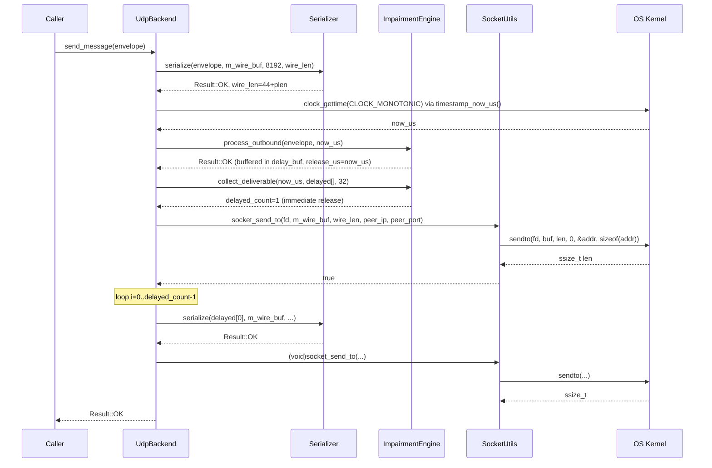
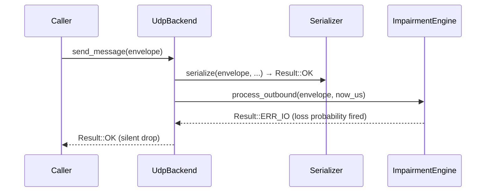

# UC_22 — UDP send datagram

**HL Group:** HL-17 — User sends or receives over UDP
**Actor:** User
**Requirement traceability:** REQ-4.1.2, REQ-6.2.1, REQ-6.2.3, REQ-5.1.1, REQ-5.1.2, REQ-5.1.3, REQ-5.1.4, REQ-7.1.4

---

## 1. Use Case Overview

### Clear description of what triggers this flow

The User calls `UdpBackend::send_message(const MessageEnvelope& envelope)` on a `UdpBackend` that has been successfully initialized. This triggers: serialization of the envelope to a wire-format byte array, optional impairment application (drop via loss/partition, delay via latency/jitter, or duplication), transmission of the surviving bytes as a single UDP datagram via `sendto(2)`, and a delayed-message flush for any previously buffered envelopes whose release time has arrived.

### Expected outcome (single goal)

At least one UDP datagram containing the serialized envelope is handed to the OS network stack via `sendto(2)`, and `Result::OK` is returned to the caller. If impairment causes a drop (`ERR_IO` from `process_outbound`), `Result::OK` is still returned with no datagram sent (silent drop by design). Any delayed envelopes from prior calls whose `release_us <= now_us` are also transmitted as part of this call.

---

## 2. Entry Points

### Exact functions, threads, or events where execution begins

**Primary entry point:**
`UdpBackend::send_message(const MessageEnvelope& envelope)` — `src/platform/UdpBackend.cpp`, line 104.
Called by any code holding a `TransportInterface*` pointing to a `UdpBackend`.
Precondition assertions (lines 106–108):
- `NEVER_COMPILED_OUT_ASSERT(m_open)`
- `NEVER_COMPILED_OUT_ASSERT(m_fd >= 0)`
- `NEVER_COMPILED_OUT_ASSERT(envelope_valid(envelope))`

**Supporting functions reached:**
- `Serializer::serialize()` — `src/core/Serializer.cpp`
- `timestamp_now_us()` — `src/core/Timestamp.hpp` (inline)
- `ImpairmentEngine::process_outbound()` — `src/platform/ImpairmentEngine.cpp:151`
- `ImpairmentEngine::collect_deliverable()` — `src/platform/ImpairmentEngine.cpp:216`
- `socket_send_to()` — `src/platform/SocketUtils.cpp:484`
- `sendto(2)` — POSIX syscall, inside `socket_send_to()`

---

## 3. End-to-End Control Flow (Step-by-Step)

1. **`UdpBackend::send_message()` entry (UdpBackend.cpp:104)**
   - `NEVER_COMPILED_OUT_ASSERT(m_open)` — transport is initialized.
   - `NEVER_COMPILED_OUT_ASSERT(m_fd >= 0)` — socket fd is valid.
   - `NEVER_COMPILED_OUT_ASSERT(envelope_valid(envelope))` — envelope is sane.

2. **`Serializer::serialize(envelope, m_wire_buf, SOCKET_RECV_BUF_BYTES, wire_len)` (Serializer.cpp)**
   - Checks `envelope_valid(env)`; returns `ERR_INVALID` if false.
   - `required_len = WIRE_HEADER_SIZE + env.payload_length` (44 + payload_length).
   - If `buf_len < required_len` → return `ERR_INVALID`.
   - Sequential big-endian writes into `m_wire_buf`:
     - offset 0: `message_type` (1 byte)
     - offset 1: `reliability_class` (1 byte)
     - offset 2: `priority` (1 byte)
     - offset 3: padding = 0 (1 byte)
     - offset 4: `message_id` (8 bytes)
     - offset 12: `timestamp_us` (8 bytes)
     - offset 20: `source_id` (4 bytes)
     - offset 24: `destination_id` (4 bytes)
     - offset 28: `expiry_time_us` (8 bytes)
     - offset 36: `payload_length` (4 bytes)
     - offset 40: padding = 0 (4 bytes)
     - offset 44: `payload[]` (payload_length bytes, verbatim via `memcpy`)
   - `out_len = WIRE_HEADER_SIZE + payload_length`; returns `Result::OK`.

3. **Check Serializer result (UdpBackend.cpp:114–117)**
   - If `!result_ok(res)` → log `WARNING_LO "Serialize failed"`; return `res`.

4. **`timestamp_now_us()` (UdpBackend.cpp:120; Timestamp.hpp)**
   - Calls `clock_gettime(CLOCK_MONOTONIC, &ts)`.
   - `NEVER_COMPILED_OUT_ASSERT(result == 0)`.
   - Returns `uint64_t`: `tv_sec * 1000000 + tv_nsec / 1000` (microseconds).
   - Assigned to local `now_us`.

5. **`ImpairmentEngine::process_outbound(envelope, now_us)` (ImpairmentEngine.cpp:151)**
   - `NEVER_COMPILED_OUT_ASSERT(m_initialized)`.
   - `NEVER_COMPILED_OUT_ASSERT(envelope_valid(in_env))`.

   **Branch A — impairments DISABLED (`m_cfg.enabled == false`):**
   - If `m_delay_count >= IMPAIR_DELAY_BUF_SIZE` → log `WARNING_HI`; return `ERR_FULL`.
   - Otherwise `queue_to_delay_buf(in_env, now_us)`: find first inactive slot in `m_delay_buf[0..31]`; `envelope_copy`; set `release_us = now_us` (immediate); `active = true`; `++m_delay_count`; return `Result::OK`.

   **Branch B — impairments ENABLED:**
   - B1. `is_partition_active(now_us)` (ImpairmentEngine.cpp:322):
     - If `partition_enabled == false` → return false.
     - State machine: first call initializes `m_next_partition_event_us`; transitions between active/inactive at configured intervals. If active → log `WARNING_LO`; return `ERR_IO` (drop).
   - B2. `check_loss()` (ImpairmentEngine.cpp:110):
     - If `loss_probability <= 0.0` → return false.
     - Draw `m_prng.next_double()`; if `< loss_probability` → log `WARNING_LO`; return `ERR_IO` (drop).
   - B3. Latency + jitter: `base_delay_us = fixed_latency_ms * 1000`. If `jitter_mean_ms > 0`: draw `m_prng.next_range(0, jitter_variance_ms)` → `jitter_us`. `release_us = now_us + base_delay_us + jitter_us`.
   - B4. If `m_delay_count >= IMPAIR_DELAY_BUF_SIZE` → log `WARNING_HI`; return `ERR_FULL`. Otherwise `queue_to_delay_buf(in_env, release_us)`.
   - B5. If `duplication_probability > 0.0`: `apply_duplication(in_env, release_us)`: draw `m_prng.next_double()`; if `< duplication_probability` and buffer not full → `queue_to_delay_buf(env, release_us + 100)`.
   - B6. `NEVER_COMPILED_OUT_ASSERT(m_delay_count <= IMPAIR_DELAY_BUF_SIZE)`. Return `Result::OK`.

6. **Check process_outbound result (UdpBackend.cpp:122–125)**
   - If `res == Result::ERR_IO`: message dropped by impairment → return `OK` to caller (silent drop).
   - Note: `ERR_FULL` is NOT intercepted here; execution falls through to `collect_deliverable` and `socket_send_to`. This is a logic gap — see Section 14, Risk 1.

7. **`ImpairmentEngine::collect_deliverable(now_us, delayed_envelopes, IMPAIR_DELAY_BUF_SIZE)` (ImpairmentEngine.cpp:216)**
   - `NEVER_COMPILED_OUT_ASSERT(m_initialized)`, `out_buf != nullptr`, `buf_cap > 0U`.
   - Loop `i = 0..31` (while `out_count < buf_cap`): if `m_delay_buf[i].active && m_delay_buf[i].release_us <= now_us` → `envelope_copy(out_buf[out_count], m_delay_buf[i].env)`; `++out_count`; `active = false`; `--m_delay_count`.
   - Returns `out_count` (0 to `IMPAIR_DELAY_BUF_SIZE = 32`).
   - On first call with no elapsed latency, returns 0; message stays buffered.

8. **Send the primary message (UdpBackend.cpp:134–140)**
   - `socket_send_to(m_fd, m_wire_buf, wire_len, m_cfg.peer_ip, m_cfg.peer_port)` (SocketUtils.cpp:484):
     - Build `sockaddr_in`: `memset`, `AF_INET`, `htons(port)`, `inet_aton(ip, &addr.sin_addr)`.
     - `inet_aton` failure → log `WARNING_LO`; return false.
     - `sendto(fd, buf, len, 0, &addr, sizeof(addr))`.
     - If `send_result < 0` → log `WARNING_LO`; return false.
     - If `(uint32_t)send_result != len` → log `WARNING_HI`; return false.
     - `NEVER_COMPILED_OUT_ASSERT((uint32_t)send_result == len)`.
     - Returns `true`.
   - If `socket_send_to` returns `false` → log `WARNING_LO`; return `ERR_IO`.

9. **Send delayed messages (UdpBackend.cpp:143–155)**
   - Fixed loop: `for i in [0, delayed_count)`:
     - `NEVER_COMPILED_OUT_ASSERT(i < IMPAIR_DELAY_BUF_SIZE)`.
     - Re-serialize `delayed_envelopes[i]` into `m_wire_buf` via `Serializer::serialize()`.
     - If serialize fails → `continue` (silently skip this envelope).
     - `(void)socket_send_to(m_fd, m_wire_buf, delayed_len, ...)` — return value discarded.

10. **Postcondition and return (UdpBackend.cpp:157–158)**
    - `NEVER_COMPILED_OUT_ASSERT(wire_len > 0U)`.
    - Return `Result::OK`.

---

## 4. Call Tree (Hierarchical)

```
UdpBackend::send_message(envelope)                    [UdpBackend.cpp:104]
├── NEVER_COMPILED_OUT_ASSERT(m_open, m_fd>=0, envelope_valid)
├── Serializer::serialize(envelope, m_wire_buf, 8192, wire_len)
│   ├── envelope_valid(env)                           [MessageEnvelope.hpp:63]
│   ├── write_u8() × 4
│   ├── write_u64() × 3
│   ├── write_u32() × 4
│   └── memcpy(payload)
├── timestamp_now_us()                                [Timestamp.hpp inline]
│   └── clock_gettime(CLOCK_MONOTONIC, &ts)           [POSIX syscall]
├── ImpairmentEngine::process_outbound(env, now_us)   [ImpairmentEngine.cpp:151]
│   ├── [if disabled] queue_to_delay_buf(env, now_us) [ImpairmentEngine.cpp:83]
│   │   └── envelope_copy() → m_delay_buf[i]
│   └── [if enabled]
│       ├── is_partition_active(now_us)               [ImpairmentEngine.cpp:322]
│       ├── check_loss()                              [ImpairmentEngine.cpp:110]
│       │   └── m_prng.next_double()
│       ├── m_prng.next_range()  [jitter]
│       ├── queue_to_delay_buf(env, release_us)       [ImpairmentEngine.cpp:83]
│       └── [if dup_prob > 0] apply_duplication(env, release_us)
│                                                     [ImpairmentEngine.cpp:127]
│           └── m_prng.next_double()
│               └── queue_to_delay_buf(env, release_us+100)
├── ImpairmentEngine::collect_deliverable(now_us, delayed, 32)
│   │                                                 [ImpairmentEngine.cpp:216]
│   └── [loop 0..31] envelope_copy + deactivate slot if release_us <= now_us
├── socket_send_to(m_fd, m_wire_buf, wire_len, peer_ip, peer_port)
│   │                                                 [SocketUtils.cpp:484]
│   ├── memset(&addr, 0, sizeof(addr))
│   ├── inet_aton(ip, &addr.sin_addr)
│   └── sendto(fd, buf, len, 0, &addr, sizeof(addr))  [POSIX syscall]
└── [loop 0..delayed_count-1] delayed message flush
    ├── Serializer::serialize(delayed_envelopes[i], m_wire_buf, ...)
    └── (void)socket_send_to(...)
        └── sendto()                                  [POSIX syscall]
```

---

## 5. Key Components Involved

| Component | File / Location | Role in this flow |
|---|---|---|
| `UdpBackend` | `src/platform/UdpBackend.cpp/.hpp` | Top-level orchestrator; owns `m_wire_buf`, `m_fd`, `m_impairment`, `m_cfg`. |
| `Serializer` | `src/core/Serializer.cpp/.hpp` | Converts `MessageEnvelope` to deterministic 44-byte big-endian header plus opaque payload bytes. |
| `ImpairmentEngine` | `src/platform/ImpairmentEngine.cpp` | Applies loss (`check_loss`), partition (`is_partition_active`), latency/jitter (`queue_to_delay_buf`), duplication (`apply_duplication`). Owns `m_delay_buf[32]`. |
| `queue_to_delay_buf()` | `ImpairmentEngine.cpp:83` | Private helper: finds first inactive slot; copies envelope; sets `release_us`; increments `m_delay_count`. |
| `socket_send_to()` | `src/platform/SocketUtils.cpp:484` | Thin POSIX wrapper: builds `sockaddr_in`; calls `sendto(2)`. |
| `timestamp_now_us()` | `src/core/Timestamp.hpp` | Inline; calls `clock_gettime(CLOCK_MONOTONIC)`; returns `uint64_t` microseconds. |
| `MessageEnvelope` | `src/core/MessageEnvelope.hpp` | Fixed-size struct (inline `payload[4096]`). `envelope_valid()` is the primary precondition check. |
| `Types.hpp` | `src/core/Types.hpp` | `SOCKET_RECV_BUF_BYTES=8192`, `IMPAIR_DELAY_BUF_SIZE=32`, `Result` enum. |
| `Logger` | `src/core/Logger.hpp` | Called on `WARNING_LO`/`WARNING_HI` error paths. |

---

## 6. Branching Logic / Decision Points

**Branch 1: Serializer failure (UdpBackend.cpp:114)**
- `!result_ok(res)` → log `WARNING_LO "Serialize failed"`; return `res`.
- Otherwise → continue to timestamp and impairment.

**Branch 2: Impairment disabled (ImpairmentEngine.cpp:159)**
- `!m_cfg.enabled` → check buffer full then `queue_to_delay_buf(env, now_us)`; return `OK` (or `ERR_FULL` if saturated).
- Otherwise → apply full impairment chain.

**Branch 3: Delay buffer full in disabled path (ImpairmentEngine.cpp:160)**
- `m_delay_count >= IMPAIR_DELAY_BUF_SIZE` when disabled → log `WARNING_HI`; return `ERR_FULL`. Falls through to sendto (Risk 1).
- Otherwise → `queue_to_delay_buf()`.

**Branch 4: Partition active (ImpairmentEngine.cpp:169)**
- `is_partition_active(now_us) == true` → log `WARNING_LO`; return `ERR_IO` → silent drop at send_message.

**Branch 5: Packet loss fires (ImpairmentEngine.cpp:176)**
- `check_loss()` returns true → log `WARNING_LO`; return `ERR_IO` → silent drop.
- Otherwise → calculate release time; buffer message.

**Branch 6: Delay buffer full in enabled path (ImpairmentEngine.cpp:192)**
- `m_delay_count >= IMPAIR_DELAY_BUF_SIZE` → log `WARNING_HI "delay buffer full; dropping message"`; return `ERR_FULL`.
- Otherwise → `queue_to_delay_buf(in_env, release_us)`.

**Branch 7: process_outbound returns ERR_IO (UdpBackend.cpp:122)**
- `res == ERR_IO` → return `OK` to caller (silent drop). Only `ERR_IO` is intercepted; `ERR_FULL` falls through.

**Branch 8: Duplication (ImpairmentEngine.cpp:136)**
- `dup_rand < duplication_probability` AND buffer not full → `queue_to_delay_buf(env, release_us + 100)`.
- Otherwise → no duplicate generated.

**Branch 9: socket_send_to failure (UdpBackend.cpp:134)**
- `socket_send_to() == false` → log `WARNING_LO`; return `ERR_IO`.
- Otherwise → continue to delayed message loop.

**Branch 10: Delayed message re-serialization failure (UdpBackend.cpp:149)**
- `!result_ok(res)` in delayed loop → `continue` (silently skip).
- Otherwise → `(void)socket_send_to()` (return value discarded).

**Branch 11: inet_aton failure (SocketUtils.cpp:500)**
- `inet_aton(ip) == 0` → log `WARNING_LO`; return false → `ERR_IO` propagates.

---

## 7. Concurrency / Threading Behavior

### Threads created

None. `UdpBackend` is designed for single-threaded use per instance. No internal worker threads.

### Where context switches occur

`sendto(2)` is the only blocking OS call on the send path. It is expected to return promptly for UDP (the datagram is handed to the kernel's send buffer). No blocking poll is used on the send path.

### Synchronization primitives

- `m_wire_buf` (uint8_t[8192], member of `UdpBackend`): no lock. Concurrent calls to `send_message()` from multiple threads would race on this buffer. The design assumes single-threaded access.
- `m_impairment` (`ImpairmentEngine`) holds mutable state (`m_delay_buf`, `m_delay_count`, PRNG state). Concurrent calls would corrupt it. Same single-thread assumption applies.
- `m_recv_queue` (`RingBuffer`) uses `std::atomic<uint32_t>` with acquire/release ordering for SPSC safety. The send path does NOT touch `m_recv_queue`.

### Producer/consumer relationships

The `collect_deliverable()` call during `send_message()` is the only mechanism by which delayed messages are flushed; delayed delivery is opportunistic, tied to subsequent `send_message()` or `receive_message()` calls, not to a background timer.

---

## 8. Memory & Ownership Semantics (C/C++ Specific)

### Who owns allocated memory

All storage is statically allocated within the `UdpBackend` object — no heap:

- `m_wire_buf` (uint8_t[8192]): inline member; overwritten on every `send_message()` call.
- `m_delay_buf` (DelayEntry[32]): inline in `ImpairmentEngine` which is an inline member of `UdpBackend`. Each `DelayEntry` contains a full `MessageEnvelope` (inline `payload[4096]`), a `uint64_t release_us`, and a `bool active`.
- `delayed_envelopes[]` (`MessageEnvelope[IMPAIR_DELAY_BUF_SIZE]`): stack-local fixed-size array within `send_message()`.

### Lifetime of key objects

- The envelope passed to `send_message()` is by `const reference`; the function reads it but does not take ownership. The caller retains ownership.
- `envelope_copy()` (`MessageEnvelope.hpp:56`) is `memcpy(&dst, &src, sizeof(MessageEnvelope))` — a deep copy including the inline `payload[4096]` array.

### Stack vs heap usage

No heap allocation. `delayed_envelopes[32]` is a stack-local with size determined at compile time (`IMPAIR_DELAY_BUF_SIZE`). `WIRE_HEADER_SIZE = 44U` is a static const member of `Serializer`.

### RAII usage

None specific to the send path. `UdpBackend::~UdpBackend()` calls `close()` for fd cleanup.

### Potential leaks or unsafe patterns

The delayed message loop reuses the same `m_wire_buf` for re-serialization, processing one delayed envelope at a time (serialize then send immediately). Safe as written; a refactor that splits serialize and send could introduce buffer aliasing.

---

## 9. Error Handling Flow

| Error | Source | Handling |
|---|---|---|
| `ERR_INVALID` | `Serializer::serialize()` | Logged `WARNING_LO`; returned immediately to caller. |
| `ERR_IO` (loss/partition) | `process_outbound()` | Intercepted at UdpBackend.cpp:122; converted to `Result::OK` (silent drop). |
| `ERR_FULL` (delay buf full) | `process_outbound()` | NOT intercepted; falls through to `collect_deliverable` + `socket_send_to`. Datagram sent without impairment tracking. Logic gap [Risk 1]. |
| `socket_send_to() == false` | `SocketUtils.cpp` | Logged `WARNING_LO`; return `ERR_IO` to caller. |
| `inet_aton()` failure | `SocketUtils.cpp:500` | Logged `WARNING_LO`; false returned from `socket_send_to()`. |
| `sendto()` partial write | `SocketUtils.cpp:517` | Logged `WARNING_HI`; false returned. |
| Delayed re-serialize fail | `UdpBackend.cpp:149` | `continue` (silently skip). |
| Delayed `socket_send_to()` fail | `UdpBackend.cpp:153` | Return value discarded; no error reported. |

---

## 10. External Interactions

| Interaction | Details |
|---|---|
| `clock_gettime(CLOCK_MONOTONIC)` | Called inside `timestamp_now_us()`. Returns `struct timespec`. `NEVER_COMPILED_OUT_ASSERT(result==0)`. |
| `sendto(2)` syscall | Called inside `socket_send_to()` (SocketUtils.cpp). Parameters: `fd=m_fd`, `buf=m_wire_buf`, `len=wire_len`, `flags=0`, `dest_addr=sockaddr_in{peer_ip, peer_port}`, `addrlen=sizeof(sockaddr_in)`. Returns `ssize_t` bytes sent or `-1`. |
| OS UDP socket | `m_fd` is an `AF_INET/SOCK_DGRAM` socket created in `init()`. Kernel may silently drop the datagram if OS send buffer is full or network is unreachable. |
| `inet_aton(3)` / `htons(3)` | POSIX library calls inside `socket_send_to()`; not syscalls but platform-specific. |

---

## 11. State Changes / Side Effects

| Object | Field | Change |
|---|---|---|
| `ImpairmentEngine` | `m_delay_buf[i].env` | Overwritten with copy of envelope (`queue_to_delay_buf`). |
| `ImpairmentEngine` | `m_delay_buf[i].active` | Set to `true` (new message buffered); set to `false` by `collect_deliverable`. |
| `ImpairmentEngine` | `m_delay_buf[i].release_us` | Set to `now_us + computed delay`. |
| `ImpairmentEngine` | `m_delay_count` | Incremented by `queue_to_delay_buf`; decremented by `collect_deliverable`. |
| `ImpairmentEngine` | PRNG internal state | Advances for loss/jitter/dup draws. |
| `ImpairmentEngine` | `m_partition_active` | May transition via `is_partition_active()`. |
| `ImpairmentEngine` | `m_next_partition_event_us` | Updated on partition transitions. |
| `UdpBackend` | `m_wire_buf` | Overwritten with serialized bytes. |
| `UdpBackend` | `m_recv_queue` | NOT modified on the send path. |
| `UdpBackend` | `m_open`, `m_fd` | NOT modified. |
| OS Kernel | UDP send buffer | Datagram enqueued for transmission. |

---

## 12. Sequence Diagram using mermaid



Drop path (loss impairment fires):



---

## 13. Initialization vs Runtime Flow

### What happens during startup (init phase)

`UdpBackend::init()` (UdpBackend.cpp:49):
- `NEVER_COMPILED_OUT_ASSERT(config.kind == TransportKind::UDP)`.
- `NEVER_COMPILED_OUT_ASSERT(!m_open)`.
- `m_cfg = config` (struct copy).
- `socket_create_udp()` → `socket(AF_INET, SOCK_DGRAM, IPPROTO_UDP)`; stored in `m_fd`.
- `socket_set_reuseaddr(m_fd)` → `setsockopt(SO_REUSEADDR)`.
- `socket_bind(m_fd, config.bind_ip, config.bind_port)` → `inet_aton` + `bind(2)`.
- `m_recv_queue.init()` → `m_head.store(0,relaxed)`, `m_tail.store(0,relaxed)`.
- `impairment_config_default(imp_cfg)` → `enabled=false`, all probs=0.0, `fixed_latency_ms=0`, `prng_seed=42`.
- If `config.num_channels > 0`: `imp_cfg.enabled = channels[0].impairments_enabled`.
- `m_impairment.init(imp_cfg)` → seed PRNG; `memset m_delay_buf`; `m_delay_count=0`.
- `m_open = true`.

All allocations are static (member arrays). No `malloc`/`new` anywhere.

### What happens during steady-state execution (runtime)

- No allocation. `m_wire_buf` is reused every call.
- `delayed_envelopes[]` is a fixed-size stack local.
- All state mutation is in-place within member objects.
- Delayed messages accumulate in `m_delay_buf` and are flushed opportunistically on subsequent `send_message()` or `receive_message()` calls.

The distinction matters for Power of 10 rule 3: heap is never touched after the init phase is complete.

---

## 14. Known Risks / Observations

**Risk 1: ERR_FULL not filtered at send_message()**
`process_outbound()` returns `ERR_FULL` when the delay buffer is saturated. `UdpBackend::send_message()` only checks for `ERR_IO` (line 122). If `ERR_FULL` is returned, execution falls through to `collect_deliverable()` and `socket_send_to()`, sending the datagram without impairment tracking. The message appears on the wire but is not in the delay buffer, breaking impairment accounting.

**Risk 2: Delayed message send result discarded (UdpBackend.cpp:153)**
`(void)socket_send_to(...)` for delayed envelopes. A network failure during the delayed flush is silently swallowed. The caller receives `Result::OK` regardless.

**Risk 3: m_wire_buf reuse within the delayed loop**
The delayed message loop re-serializes into the same `m_wire_buf`. The loop serializes and immediately sends each delayed envelope — safe as written. A future refactor that splits serialize from send could introduce a buffer aliasing bug.

**Risk 4: Opportunistic delayed flush timing**
Delayed messages accumulate in `m_delay_buf` and are only flushed when `send_message()` or `receive_message()` is called. If neither is called for an extended period, delayed messages will not be delivered, causing unexpected timing behavior.

**Risk 5: No IPv6 support**
`socket_send_to()` hardcodes `AF_INET` and uses `inet_aton()`. `inet_aton` does not support IPv6.

**Risk 6: inet_aton vs inet_pton**
`inet_aton()` is used throughout `SocketUtils.cpp`. POSIX marks it as obsolescent; `inet_pton` is preferred. This is a portability concern.

**Risk 7: NEVER_COMPILED_OUT_ASSERT is always active**
Unlike standard `assert()`, `NEVER_COMPILED_OUT_ASSERT` fires regardless of `NDEBUG`. Precondition failures will trigger FATAL + component reset in production builds.

---

## 15. Unknowns / Assumptions

- [ASSUMPTION] `timestamp_now_us()` (Timestamp.hpp) uses `clock_gettime(CLOCK_MONOTONIC)`. Returns `uint64_t` microseconds since an arbitrary system epoch. Not subject to NTP adjustments.

- [ASSUMPTION] `envelope_valid(envelope)` checks: `env.message_type != MessageType::INVALID`, `env.payload_length <= MSG_MAX_PAYLOAD_BYTES`, `env.source_id != NODE_ID_INVALID`. Confirmed in `MessageEnvelope.hpp:63`.

- [ASSUMPTION] `envelope_copy()` (`MessageEnvelope.hpp:56`) is `(void)memcpy(&dst, &src, sizeof(MessageEnvelope))` — deep copy including inline `payload[4096]`. Confirmed.

- [ASSUMPTION] `WIRE_HEADER_SIZE = 44U` is a static const member of `Serializer`. Confirmed.

- [ASSUMPTION] `impairment_config_default()` sets `enabled=false`, all probabilities=0.0, `fixed_latency_ms=0`, `prng_seed=42`. Confirmed in `ImpairmentConfig.hpp`.

- [ASSUMPTION] The caller guarantees single-threaded access to any given `UdpBackend` instance. The code has no mutex protecting `m_wire_buf` or `m_impairment`.

- [ASSUMPTION] `m_prng` is a `PrngEngine` (ImpairmentEngine.hpp). Its exact algorithm is in `src/platform/PrngEngine.hpp`; the interface exposes `next_double()` and `next_range()`.

- [ASSUMPTION] `Logger::log()` is thread-safe or only called from a single thread context. No mutex is visible at its call sites.
