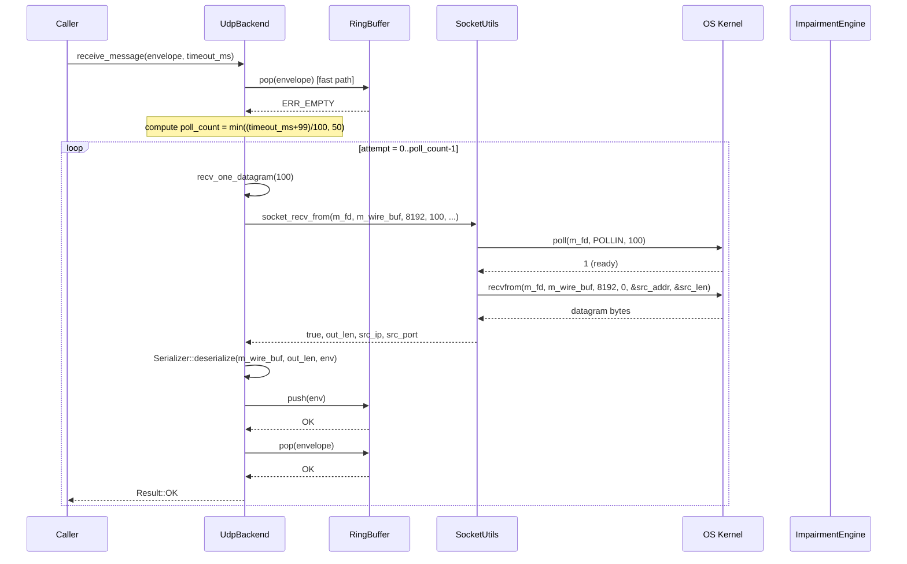
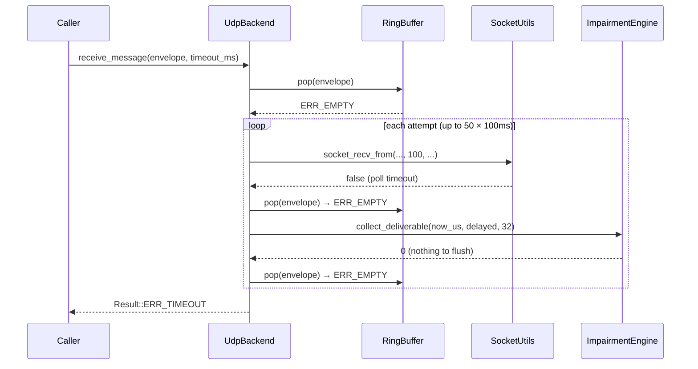

# UC_23 — UDP receive datagram

**HL Group:** HL-17 — User sends or receives over UDP
**Actor:** User
**Requirement traceability:** REQ-4.1.3, REQ-6.2.1, REQ-6.2.2, REQ-6.2.4, REQ-3.2.6, REQ-7.1.4

---

## 1. Use Case Overview

### Clear description of what triggers this flow

The User calls `UdpBackend::receive_message(MessageEnvelope& envelope, uint32_t timeout_ms)` on a `UdpBackend` that has been successfully initialized. The call checks the internal ring buffer for a pre-queued message, then polls the UDP socket for new datagrams in a bounded loop (up to 50 iterations × 100 ms each = up to 5 seconds). On each iteration it also flushes any delayed messages from the impairment engine that have reached their `release_us` time.

### Expected outcome (single goal)

A valid `MessageEnvelope` is written into the caller's reference and `Result::OK` is returned. If no message arrives within the bounded timeout window, `Result::ERR_TIMEOUT` is returned with the envelope unmodified.

---

## 2. Entry Points

### Exact functions, threads, or events where execution begins

**Primary entry point:**
`UdpBackend::receive_message(MessageEnvelope& envelope, uint32_t timeout_ms)` — `src/platform/UdpBackend.cpp`, line 220.
Precondition assertions (lines 222–223):
- `NEVER_COMPILED_OUT_ASSERT(m_open)`
- `NEVER_COMPILED_OUT_ASSERT(m_fd >= 0)`

**Supporting functions reached:**
- `RingBuffer::pop()` — `src/core/RingBuffer.hpp`
- `UdpBackend::recv_one_datagram()` — `UdpBackend.cpp:165`
- `socket_recv_from()` — `src/platform/SocketUtils.cpp:532`
- `Serializer::deserialize()` — `src/core/Serializer.cpp`
- `RingBuffer::push()` — `src/core/RingBuffer.hpp`
- `UdpBackend::flush_delayed_to_queue()` — `UdpBackend.cpp:200`
- `ImpairmentEngine::collect_deliverable()` — `src/platform/ImpairmentEngine.cpp:216`
- `timestamp_now_us()` — `src/core/Timestamp.hpp` (inline)

---

## 3. End-to-End Control Flow (Step-by-Step)

1. **`UdpBackend::receive_message()` entry (UdpBackend.cpp:220)**
   - `NEVER_COMPILED_OUT_ASSERT(m_open)` — transport is initialized.
   - `NEVER_COMPILED_OUT_ASSERT(m_fd >= 0)` — socket fd is valid.

2. **Fast path: check ring buffer first (UdpBackend.cpp:226–229)**
   - `m_recv_queue.pop(envelope)` (`RingBuffer.hpp`):
     - Loads `m_head` with acquire ordering.
     - If `m_head == m_tail` → queue is empty; returns `ERR_EMPTY`.
     - Otherwise: `envelope_copy(m_buf[m_head % MSG_RING_CAPACITY], envelope)`; increments `m_head` with release ordering; returns `OK`.
   - If `result_ok(res)` → return `OK` immediately (message was already queued from a prior poll).

3. **Compute bounded poll count (UdpBackend.cpp:231–235)**
   - `poll_count = (timeout_ms + 99U) / 100U` — ceiling division to convert to 100 ms units.
   - If `poll_count > 50U` → cap at 50 (maximum 5 seconds).
   - `NEVER_COMPILED_OUT_ASSERT(poll_count <= 50U)` — Power of 10 bounded loop count.

4. **Bounded poll loop (UdpBackend.cpp:238–253)**
   Power of 10 rule 2: fixed loop bound (capped at 50 above).

   For each attempt `= 0..poll_count-1`:

   **4a. `recv_one_datagram(100U)` (UdpBackend.cpp:239; UdpBackend.cpp:165)**
   - `NEVER_COMPILED_OUT_ASSERT(m_open)`, `NEVER_COMPILED_OUT_ASSERT(m_fd >= 0)`.
   - `uint32_t out_len = 0U`; `char src_ip[48]`; `uint16_t src_port = 0U`.
   - `socket_recv_from(m_fd, m_wire_buf, SOCKET_RECV_BUF_BYTES, 100U, &out_len, src_ip, &src_port)` (SocketUtils.cpp:532):
     - `NEVER_COMPILED_OUT_ASSERT` checks on all pointer parameters.
     - `poll(m_fd, POLLIN, 100)` — wait up to 100 ms for readability.
     - If `poll_result <= 0` → log `WARNING_LO "recvfrom poll timeout"`; return false.
     - `recvfrom(fd, m_wire_buf, SOCKET_RECV_BUF_BYTES, 0, &src_addr, &src_len)` → receive up to 8192 bytes.
     - If `recv_result < 0` → log `WARNING_LO "recvfrom() failed"`; return false.
     - If `recv_result == 0` → log `WARNING_LO "recvfrom() returned 0 bytes"`; return false.
     - `inet_ntop(AF_INET, &src_addr.sin_addr, out_ip, 48)` — extract source IP string.
     - If `inet_ntop` returns `nullptr` → log `WARNING_LO`; return false.
     - `*out_port = ntohs(src_addr.sin_port)`.
     - `*out_len = (uint32_t)recv_result`.
     - `NEVER_COMPILED_OUT_ASSERT(*out_len > 0U && *out_len <= buf_cap)`.
     - Returns `true`.
   - If `socket_recv_from` returns false → `recv_one_datagram` returns false. No envelope queued for this attempt.
   - If true: `Serializer::deserialize(m_wire_buf, out_len, env)` (Serializer.cpp):
     - Reads 44-byte header big-endian; validates length field; copies payload via `memcpy`.
     - Returns `ERR_INVALID` if length fields are inconsistent or buffer too short.
     - Returns `OK` on success; populates `env`.
   - If deserialize fails → log `WARNING_LO "Deserialize failed: %u"`; `recv_one_datagram` returns false.
   - `m_recv_queue.push(env)` (`RingBuffer.hpp`):
     - Loads `m_tail` with acquire ordering; checks if full (`m_tail - m_head >= MSG_RING_CAPACITY = 64`).
     - If full → returns `ERR_FULL`; `UdpBackend.cpp:188`: log `WARNING_HI "Recv queue full; dropping datagram from %s:%u"`.
     - Otherwise: `envelope_copy(m_buf[m_tail % MSG_RING_CAPACITY], env)`; increments `m_tail` with release ordering; returns `OK`.
   - `recv_one_datagram` returns `true` (even if push failed; the datagram was received but dropped).

   **4b. Try pop from ring buffer (UdpBackend.cpp:241–244)**
   - `m_recv_queue.pop(envelope)`.
   - If `result_ok(res)` → return `OK` immediately.

   **4c. `timestamp_now_us()` (UdpBackend.cpp:246)**
   - `clock_gettime(CLOCK_MONOTONIC, &ts)`; returns `uint64_t` microseconds.
   - Assigned to local `now_us`.

   **4d. `flush_delayed_to_queue(now_us)` (UdpBackend.cpp:247; UdpBackend.cpp:200)**
   - `NEVER_COMPILED_OUT_ASSERT(now_us > 0ULL)`, `NEVER_COMPILED_OUT_ASSERT(m_open)`.
   - `ImpairmentEngine::collect_deliverable(now_us, delayed, IMPAIR_DELAY_BUF_SIZE)` (ImpairmentEngine.cpp:216):
     - Scans `m_delay_buf[0..31]`: for each `active` entry where `release_us <= now_us`, copies to `delayed[]`, marks slot inactive, decrements `m_delay_count`.
     - Returns `count` (0 to 32).
   - Fixed loop `i = 0..count-1`: `NEVER_COMPILED_OUT_ASSERT(i < IMPAIR_DELAY_BUF_SIZE)`; `(void)m_recv_queue.push(delayed[i])`.

   **4e. Try pop from ring buffer again (UdpBackend.cpp:249–252)**
   - `m_recv_queue.pop(envelope)`.
   - If `result_ok(res)` → return `OK`.

5. **Timeout — loop exhausted (UdpBackend.cpp:255)**
   - Return `Result::ERR_TIMEOUT`. The envelope reference is unmodified.

---

## 4. Call Tree (Hierarchical)

```
UdpBackend::receive_message(envelope, timeout_ms)          [UdpBackend.cpp:220]
├── NEVER_COMPILED_OUT_ASSERT(m_open, m_fd>=0)
├── m_recv_queue.pop(envelope)                             [RingBuffer.hpp — fast path]
│   └── envelope_copy() if non-empty
├── [compute poll_count = min((timeout_ms+99)/100, 50)]
└── [loop 0..poll_count-1]
    ├── recv_one_datagram(100U)                            [UdpBackend.cpp:165]
    │   ├── socket_recv_from(m_fd, m_wire_buf, 8192, 100,
    │   │                     &out_len, src_ip, &src_port) [SocketUtils.cpp:532]
    │   │   ├── poll(m_fd, POLLIN, 100)                   [POSIX syscall]
    │   │   ├── recvfrom(fd, m_wire_buf, 8192, 0,
    │   │   │             &src_addr, &src_len)             [POSIX syscall]
    │   │   └── inet_ntop(AF_INET, &src_addr.sin_addr, ...)
    │   ├── Serializer::deserialize(m_wire_buf, out_len, env)
    │   └── m_recv_queue.push(env)                        [RingBuffer.hpp]
    │       └── envelope_copy() into m_buf slot
    ├── m_recv_queue.pop(envelope)                        [RingBuffer.hpp]
    ├── timestamp_now_us()                                 [Timestamp.hpp inline]
    │   └── clock_gettime(CLOCK_MONOTONIC, &ts)           [POSIX syscall]
    ├── flush_delayed_to_queue(now_us)                    [UdpBackend.cpp:200]
    │   └── ImpairmentEngine::collect_deliverable(now_us, delayed, 32)
    │       │                                             [ImpairmentEngine.cpp:216]
    │       └── [loop 0..31] envelope_copy + deactivate if release_us<=now_us
    │       └── [loop 0..count-1] m_recv_queue.push(delayed[i])
    └── m_recv_queue.pop(envelope)                        [RingBuffer.hpp]
```

---

## 5. Key Components Involved

| Component | File / Location | Role in this flow |
|---|---|---|
| `UdpBackend` | `src/platform/UdpBackend.cpp/.hpp` | Orchestrator; owns `m_fd`, `m_wire_buf`, `m_recv_queue`, `m_impairment`. |
| `UdpBackend::recv_one_datagram()` | `UdpBackend.cpp:165` | Private helper: polls socket once (100 ms), receives one datagram, deserializes, pushes to ring buffer. |
| `UdpBackend::flush_delayed_to_queue()` | `UdpBackend.cpp:200` | Private helper: calls `collect_deliverable()`, pushes each resulting envelope to `m_recv_queue`. |
| `RingBuffer` | `src/core/RingBuffer.hpp` | Lock-free SPSC ring buffer (capacity 64). Stores deserialized `MessageEnvelope` objects waiting for the caller. |
| `socket_recv_from()` | `src/platform/SocketUtils.cpp:532` | Thin POSIX wrapper: `poll()` + `recvfrom(2)` + `inet_ntop`. Returns datagram bytes and source address. |
| `Serializer::deserialize()` | `src/core/Serializer.cpp` | Reads 44-byte big-endian wire header; validates length; copies payload. Returns `ERR_INVALID` on malformed input. |
| `ImpairmentEngine::collect_deliverable()` | `src/platform/ImpairmentEngine.cpp:216` | Scans delay buffer for entries whose `release_us <= now_us`; copies them out; clears slots. |
| `timestamp_now_us()` | `src/core/Timestamp.hpp` | Inline; `clock_gettime(CLOCK_MONOTONIC)`; returns `uint64_t` microseconds. |
| `Types.hpp` | `src/core/Types.hpp` | `SOCKET_RECV_BUF_BYTES=8192`, `IMPAIR_DELAY_BUF_SIZE=32`, `MSG_RING_CAPACITY=64`. |
| `Logger` | `src/core/Logger.hpp` | Called on `WARNING_LO`/`WARNING_HI` for timeout, deserialize failure, queue full. |

---

## 6. Branching Logic / Decision Points

**Branch 1: Fast-path ring buffer pop (UdpBackend.cpp:226–229)**
- `m_recv_queue.pop()` returns `OK` → return `OK` immediately; skip loop entirely.
- Returns `ERR_EMPTY` → proceed to compute `poll_count` and enter loop.

**Branch 2: Poll timeout exceeded (SocketUtils.cpp:551)**
- `poll_result <= 0` → log `WARNING_LO "recvfrom poll timeout"`; `socket_recv_from` returns false.
- `poll_result > 0` → proceed to `recvfrom(2)`.

**Branch 3: recvfrom error (SocketUtils.cpp:565)**
- `recv_result < 0` → log `WARNING_LO "recvfrom() failed"`; return false.
- `recv_result == 0` → log `WARNING_LO "recvfrom() returned 0 bytes"`; return false.
- `recv_result > 0` → extract source address; proceed to `inet_ntop`.

**Branch 4: inet_ntop failure (SocketUtils.cpp:578–583)**
- `inet_ntop` returns `nullptr` → log `WARNING_LO`; return false.
- Returns non-null → set `*out_ip`, `*out_port`, `*out_len`; return true.

**Branch 5: Deserialize failure (UdpBackend.cpp:181–185)**
- `!result_ok(res)` → log `WARNING_LO "Deserialize failed"`; `recv_one_datagram` returns false.
- `result_ok(res)` → proceed to push.

**Branch 6: Ring buffer full on push (UdpBackend.cpp:187–191)**
- `m_recv_queue.push()` returns `ERR_FULL` → log `WARNING_HI "Recv queue full; dropping datagram"`; `recv_one_datagram` still returns true (datagram was received, but envelope was dropped).
- Returns `OK` → envelope is now in `m_recv_queue`.

**Branch 7: Pop after recv_one_datagram (UdpBackend.cpp:241–244)**
- `m_recv_queue.pop()` returns `OK` → return `OK` immediately.
- Returns `ERR_EMPTY` → proceed to `timestamp_now_us()` and `flush_delayed_to_queue()`.

**Branch 8: Pop after flush_delayed_to_queue (UdpBackend.cpp:249–252)**
- `m_recv_queue.pop()` returns `OK` → return `OK`.
- Returns `ERR_EMPTY` → continue to next loop iteration.

**Branch 9: Loop exhausted (UdpBackend.cpp:255)**
- All `poll_count` iterations completed without a message → return `ERR_TIMEOUT`.

**Branch 10: Delayed message ready in flush (ImpairmentEngine.cpp:229)**
- `m_delay_buf[i].active && m_delay_buf[i].release_us <= now_us` → copy to output; deactivate slot.
- Otherwise → skip slot.

---

## 7. Concurrency / Threading Behavior

### Threads created

None. `UdpBackend` is single-threaded by design. `receive_message()` is not re-entrant.

### Where context switches occur

`poll(2)` inside `socket_recv_from()` is the only blocking call, with a 100 ms per-iteration timeout. The outer loop can block up to `poll_count × 100 ms` (≤ 5 seconds). If SIGINT arrives during `poll(2)`, it returns `-1` with `errno=EINTR` (or `0` on some platforms); `socket_recv_from` treats this as a timeout and returns false for that iteration.

### Synchronization primitives

- `RingBuffer` uses `std::atomic<uint32_t>` (`m_head`, `m_tail`) with acquire/release memory ordering for SPSC lock-free safety. Push and pop access different atomic variables, so no mutual exclusion is needed in the SPSC model.
- `m_wire_buf`, `m_impairment`, and `m_recv_queue` members have no additional locks. Concurrent `receive_message()` calls from multiple threads would race on `m_wire_buf` and `m_impairment`. The design assumes single-threaded access.

### Producer/consumer relationships

- **Producer role:** `recv_one_datagram()` and `flush_delayed_to_queue()` call `m_recv_queue.push()`.
- **Consumer role:** `receive_message()` calls `m_recv_queue.pop()`.
- In practice both roles execute on the same main thread.

---

## 8. Memory & Ownership Semantics (C/C++ Specific)

### Who owns allocated memory

All storage is statically allocated within the `UdpBackend` object — no heap:

- `m_wire_buf` (uint8_t[8192]): inline member; overwritten on every `recv_one_datagram()` call.
- `m_recv_queue.m_buf` (`MessageEnvelope[64]`): inline in `RingBuffer` which is an inline member of `UdpBackend`. Total size 64 × `sizeof(MessageEnvelope)`.
- `delayed[]` (`MessageEnvelope[IMPAIR_DELAY_BUF_SIZE]`): stack-local in `flush_delayed_to_queue()`. Fixed size 32 at compile time.
- `src_ip[48]` and `src_port`: stack locals in `recv_one_datagram()`.

### Lifetime of key objects

- The `envelope` reference passed to `receive_message()` is written by `m_recv_queue.pop()` via `envelope_copy()`. The caller owns the `MessageEnvelope` object.
- `envelope_copy()` (`MessageEnvelope.hpp:56`) is `memcpy(&dst, &src, sizeof(MessageEnvelope))` — deep copy including inline `payload[4096]`.
- Deserialized envelopes in `m_recv_queue.m_buf[]` exist until popped; they are value copies.

### Stack vs heap usage

No heap. `delayed[32]` in `flush_delayed_to_queue()` is bounded at compile time.

### RAII usage

None specific to the receive path. `UdpBackend::~UdpBackend()` calls `close()` for fd cleanup.

### Potential leaks or unsafe patterns

If `m_recv_queue` is full when `recv_one_datagram()` calls `push()`, the deserialized envelope is silently dropped. There is no backpressure mechanism to the sender. This is an expected condition (queue full at `WARNING_HI`), not a leak.

---

## 9. Error Handling Flow

| Error | Source | Handling |
|---|---|---|
| `poll()` timeout or error | `socket_recv_from()` (SocketUtils.cpp:551) | Log `WARNING_LO`; return false; iteration continues. |
| `recvfrom()` fails | `socket_recv_from()` (SocketUtils.cpp:565) | Log `WARNING_LO`; return false; iteration continues. |
| `recvfrom()` returns 0 | `socket_recv_from()` (SocketUtils.cpp:571) | Log `WARNING_LO`; return false; iteration continues. |
| `inet_ntop()` fails | `socket_recv_from()` (SocketUtils.cpp:578) | Log `WARNING_LO`; return false; iteration continues. |
| Deserialize fails | `recv_one_datagram()` (UdpBackend.cpp:181) | Log `WARNING_LO "Deserialize failed: %u"`; return false; iteration continues. |
| Ring buffer full | `recv_one_datagram()` (UdpBackend.cpp:187) | Log `WARNING_HI "Recv queue full; dropping datagram"`; datagram silently dropped. `recv_one_datagram` still returns true. |
| Delayed push fails | `flush_delayed_to_queue()` (UdpBackend.cpp:212) | Return value of `push()` discarded with `(void)`. Silent drop. |
| Loop exhausted | `receive_message()` (UdpBackend.cpp:255) | Return `ERR_TIMEOUT`. Envelope unmodified. |

**Severity mapping (F-Prime model):**
- `WARNING_LO` — localized, recoverable (single datagram lost or timeout).
- `WARNING_HI` — system-wide but recoverable (receive queue saturated).
- `FATAL` — not emitted on the receive path.

---

## 10. External Interactions

| Interaction | Details |
|---|---|
| `poll(2)` syscall | Called inside `socket_recv_from()` (SocketUtils.cpp:550). `fd=m_fd`, `events=POLLIN`, `timeout=100ms`. Returns number of ready fds or -1/0 on error/timeout. |
| `recvfrom(2)` syscall | Called inside `socket_recv_from()` (SocketUtils.cpp:562). Reads one UDP datagram from the bound socket. Returns datagram length or -1 on error. |
| `inet_ntop(3)` | Called inside `socket_recv_from()` to convert source `in_addr` to printable IPv4 string. |
| `clock_gettime(CLOCK_MONOTONIC)` | Called inside `timestamp_now_us()`. Used for `flush_delayed_to_queue()` comparison. |
| OS UDP socket | `m_fd` is the bound `AF_INET/SOCK_DGRAM` socket from `init()`. The kernel buffers incoming datagrams until `recvfrom()` is called. Datagrams arriving when the kernel buffer is full are silently dropped by the OS. |

No TLS/DTLS hooks are invoked. No TCP-style connection state is involved.

---

## 11. State Changes / Side Effects

| Object | Field | Change |
|---|---|---|
| `UdpBackend` | `m_wire_buf` | Overwritten with raw bytes from `recvfrom()` on each successful `recv_one_datagram()` call. |
| `RingBuffer` | `m_tail` | Incremented on each successful `push()`. |
| `RingBuffer` | `m_head` | Incremented on each successful `pop()`. |
| `RingBuffer` | `m_buf[tail % 64]` | Written with deserialized `MessageEnvelope` on push; read on pop. |
| `ImpairmentEngine` | `m_delay_buf[i].active` | Set to `false` when `release_us <= now_us` in `collect_deliverable`. |
| `ImpairmentEngine` | `m_delay_count` | Decremented for each delivered delayed message. |
| Caller's `envelope` | all fields | Overwritten on `OK` return; unmodified on `ERR_TIMEOUT`. |
| OS Kernel | UDP receive buffer | Datagram consumed by `recvfrom()`; removed from kernel buffer. |

---

## 12. Sequence Diagram using mermaid



Timeout path (no datagram arrives):



---

## 13. Initialization vs Runtime Flow

### What happens during startup (init phase)

`UdpBackend::init()` (UdpBackend.cpp:49): creates UDP socket, sets `SO_REUSEADDR`, binds to `bind_ip:bind_port`, initializes `m_recv_queue` (atomic head/tail to 0), initializes `m_impairment` (PRNG seeded, delay buffer zeroed). Sets `m_open = true`. No allocation after init. See UC_22 §13 for full init details.

### What happens during steady-state execution (runtime)

- No allocation. `m_wire_buf` is reused every call. `delayed[]` is a bounded stack local.
- Each call makes up to 50 poll iterations × 100 ms = up to 5 seconds maximum latency.
- The `flush_delayed_to_queue()` call on each iteration delivers impairment-delayed messages from prior `send_message()` calls that have now elapsed. This makes delayed message delivery opportunistic: it depends on someone calling `receive_message()`.
- The bounded loop with `poll_count <= 50` satisfies Power of 10 rule 2.

---

## 14. Known Risks / Observations

**Risk 1: Delayed message delivery is opportunistic**
Delayed messages (from impairment latency/jitter) are only flushed when `receive_message()` or `send_message()` is called. If neither is invoked for a long period, delayed messages accumulate in `m_delay_buf` and are not delivered despite their `release_us` having passed. There is no background timer.

**Risk 2: Ring buffer full silently drops datagrams**
If `m_recv_queue` fills up (capacity 64) before the caller pops messages, incoming datagrams are deserialized but then dropped at the `push()` step. Only a `WARNING_HI` log indicates this. No backpressure to the sender.

**Risk 3: Source address not validated against configured peer**
`recv_one_datagram()` accepts datagrams from any source address and port (`recvfrom` with no filter). The requirement [REQ-6.2.4] ("Validate source address and basic sanity of incoming datagrams") is only partially met: deserialization validates the wire format but the source IP/port is not checked against `m_cfg.peer_ip`/`m_cfg.peer_port`.

**Risk 4: Delayed flush push result discarded**
In `flush_delayed_to_queue()`, `(void)m_recv_queue.push(delayed[i])`. If the ring buffer is full, the delayed envelope is silently dropped and the `ERR_FULL` result is discarded.

**Risk 5: poll() interrupted by signal**
If SIGINT arrives during `poll(2)` inside `socket_recv_from()`, `poll` returns -1 with `errno=EINTR`. `socket_recv_from()` treats `poll_result <= 0` as a timeout and returns false. The outer loop continues to the next iteration. If `g_stop_flag` is set, the caller will detect it at the top of its own loop; the receive path itself has no stop-flag awareness.

**Risk 6: Large payload stack pressure in flush**
`flush_delayed_to_queue()` declares `MessageEnvelope delayed[IMPAIR_DELAY_BUF_SIZE]` on its stack frame — 32 × `sizeof(MessageEnvelope)`. Each `MessageEnvelope` is approximately 4096 + 40 bytes. This amounts to ~132 KB of stack usage in the worst case. [ASSUMPTION: the platform's default stack is large enough; see docs/STACK_ANALYSIS.md.]

---

## 15. Unknowns / Assumptions

- [ASSUMPTION] `socket_recv_from()` returns false for both genuine errors and innocent timeouts (`poll` returning 0). No distinction is made between these cases in `recv_one_datagram()`. A genuine `EBADF` error from `recvfrom` would be treated the same as a timeout — the outer loop continues rather than aborting.

- [ASSUMPTION] `Serializer::deserialize()` validates the wire format length fields and returns `ERR_INVALID` for malformed input. Confirmed by reading `Serializer.hpp`. It does not validate `source_id` or `destination_id` semantically; that is the caller's responsibility.

- [ASSUMPTION] `envelope_copy()` is `memcpy(&dst, &src, sizeof(MessageEnvelope))`. Confirmed in `MessageEnvelope.hpp:56`.

- [ASSUMPTION] `RingBuffer::pop()` uses acquire/release ordering compatible with SPSC use. In the single-threaded model used here, this is safe but has unnecessary memory ordering overhead.

- [ASSUMPTION] `timestamp_now_us()` uses `clock_gettime(CLOCK_MONOTONIC)`. Returns microseconds. Not wall-clock time; not subject to NTP adjustments.

- [ASSUMPTION] `ImpairmentEngine::collect_deliverable()` only collects messages where `release_us <= now_us`. If `now_us` advances by less than the configured `fixed_latency_ms`, no delayed messages are flushed during this iteration.

- [ASSUMPTION] `Logger::log()` is thread-safe or is only called from a single thread context.

- [UNKNOWN] Whether `recvfrom()` on a UDP socket can return a zero-length datagram (`recv_result == 0`) in practice. POSIX allows zero-length UDP datagrams; the code correctly handles this case by returning false from `socket_recv_from()`.
