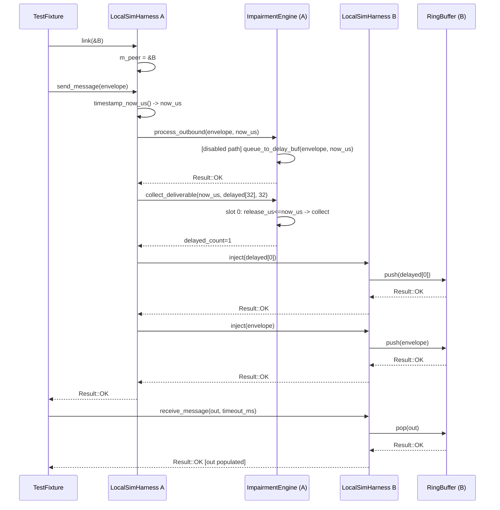

# UC_24 — LocalSimHarness in-process delivery

**HL Group:** HL-14 — User links two in-process endpoints
**Actor:** System
**Requirement traceability:** REQ-4.1.2, REQ-4.1.3, REQ-5.3.2

---

## 1. Use Case Overview

### What triggers this flow

A test fixture or simulation orchestrator has constructed two `LocalSimHarness` instances (A and B), called `init()` on each, and called `A.link(&B)` to establish a unidirectional delivery path. The trigger is a call to `A.send_message(envelope)` followed by `B.receive_message(out, timeout_ms)`.

### Expected outcome (single goal)

The `MessageEnvelope` passed to `A.send_message()` is delivered into `B`'s receive queue through an in-memory path — no real sockets, no OS network stack. `B.receive_message()` returns `Result::OK` with the envelope populated.

---

## 2. Entry Points

**Setup:**
- `LocalSimHarness::link(LocalSimHarness* peer)` — `src/platform/LocalSimHarness.cpp`, line 78
  - Called once before the first `send_message()`. Sets `A.m_peer = &B`.

**Send:**
- `LocalSimHarness::send_message(const MessageEnvelope& envelope)` — `src/platform/LocalSimHarness.cpp`, line 109
  - Called by the test fixture on instance A.

**Internal injection (called from send_message):**
- `LocalSimHarness::inject(const MessageEnvelope& envelope)` — `src/platform/LocalSimHarness.cpp`, line 91
  - Called by A on instance B to push envelopes into B's receive queue.

**Receive:**
- `LocalSimHarness::receive_message(MessageEnvelope& envelope, uint32_t timeout_ms)` — `src/platform/LocalSimHarness.cpp`, line 147
  - Called by the test fixture on instance B.

**Supporting calls:**
- `timestamp_now_us()` — `src/core/Timestamp.hpp` (inline): calls `clock_gettime(CLOCK_MONOTONIC)`.
- `ImpairmentEngine::process_outbound(envelope, now_us)` — `src/platform/ImpairmentEngine.cpp`, line 151.
- `ImpairmentEngine::collect_deliverable(now_us, buf, cap)` — `src/platform/ImpairmentEngine.cpp`, line 216.
- `RingBuffer::push(envelope)` and `RingBuffer::pop(envelope)` — `src/core/RingBuffer.hpp`.
- `nanosleep(2)` — POSIX; only called on the receive path when the queue is initially empty.

---

## 3. End-to-End Control Flow (Step-by-Step)

**Phase 1 — Setup: A.link(&B)**

1. `A.link(&B)` is entered (`LocalSimHarness.cpp:78`).
2. `NEVER_COMPILED_OUT_ASSERT(peer != nullptr)` fires (line 80).
3. `NEVER_COMPILED_OUT_ASSERT(peer != this)` fires (line 81) — forbids self-link.
4. `A.m_peer = &B` — raw non-owning pointer stored.
5. `Logger::log(INFO, "LocalSimHarness", "Harness linked to peer")`.
6. Returns. `B.m_peer` is not affected; bidirectional delivery requires `B.link(&A)` separately.

**Phase 2 — A.send_message(envelope)**

7. `A.send_message(envelope)` entered (`LocalSimHarness.cpp:109`).
8. Precondition assertions: `m_open`, `m_peer != nullptr`, `envelope_valid(envelope)`.
9. `now_us = timestamp_now_us()` — inline call to `clock_gettime(CLOCK_MONOTONIC, &ts)`; returns microseconds.
10. `res = A.m_impairment.process_outbound(envelope, now_us)` (`ImpairmentEngine.cpp:151`):
    - Asserts `m_initialized` and `envelope_valid`.
    - **Impairments disabled path** (`m_cfg.enabled == false`): if delay buffer not full, calls `queue_to_delay_buf(envelope, now_us)` — sets `m_delay_buf[slot].release_us = now_us` (immediate), `active = true`, increments `m_delay_count`. Returns `Result::OK`.
    - **Impairments enabled path**: checks `is_partition_active(now_us)`; if partition active returns `ERR_IO`. Then calls `check_loss()` (draws `m_prng.next_double()`); if loss fires returns `ERR_IO`. Computes `release_us = now_us + latency_us + jitter_us`. Calls `queue_to_delay_buf(envelope, release_us)`. Optionally calls `apply_duplication()`. Returns `Result::OK`.
11. Check `process_outbound` result (`LocalSimHarness.cpp:118`): if `res == ERR_IO` (loss or partition), returns `Result::OK` silently — B never sees the message.
12. `delayed_count = A.m_impairment.collect_deliverable(now_us, delayed_envelopes[IMPAIR_DELAY_BUF_SIZE], IMPAIR_DELAY_BUF_SIZE)` (`ImpairmentEngine.cpp:216`): iterates `m_delay_buf[0..31]`; for each slot where `active && release_us <= now_us`, copies to `out_buf`, clears the slot, decrements `m_delay_count`. With impairments disabled and `release_us == now_us`, `delayed_count = 1`.
13. Loop over `delayed_count` entries (`LocalSimHarness.cpp:131`): for each, calls `(void)m_peer->inject(delayed_envelopes[i])` — return value is discarded (see RISK-4).
14. `B.inject(delayed_envelopes[i])` (`LocalSimHarness.cpp:91`): asserts `m_open`, calls `B.m_recv_queue.push(env)`. On `ERR_FULL`, logs `WARNING_HI`.
15. `RingBuffer::push(env)` (`RingBuffer.hpp`): loads `t = m_tail.load(relaxed)`, `h = m_head.load(acquire)`. If `t - h >= MSG_RING_CAPACITY` returns `ERR_FULL`. Else calls `envelope_copy(m_buf[t & RING_MASK], env)`, stores `m_tail.store(t+1, release)`. Returns `OK`.
16. `res = m_peer->inject(envelope)` (`LocalSimHarness.cpp:137`): injects the original (non-delayed) envelope into B. Same `RingBuffer::push` path.
17. Post-condition assert `res == OK || res == ERR_FULL`. Returns `res`.

**Phase 3 — B.receive_message(envelope, timeout_ms)**

18. `B.receive_message(envelope, timeout_ms)` entered (`LocalSimHarness.cpp:147`). Asserts `m_open`.
19. Fast-path: `res = B.m_recv_queue.pop(envelope)` (`RingBuffer.hpp`): loads `h = m_head.load(relaxed)`, `t = m_tail.load(acquire)`. If `t - h == 0` returns `ERR_EMPTY`. Else `envelope_copy(envelope, m_buf[h & RING_MASK])`, `m_head.store(h+1, release)`. Returns `OK`.
20. If fast-path succeeds: return `OK` immediately (typical path when B's queue was populated in Phase 2).
21. If `timeout_ms == 0`: return `ERR_TIMEOUT` (non-blocking).
22. If queue was empty: compute `iterations = min(timeout_ms, 5000U)`. Poll loop: sleep `nanosleep({0, 1000000})` (1 ms), then `pop()`. Repeat up to `iterations` times. Return `OK` on success, `ERR_TIMEOUT` on exhaustion.

---

## 4. Call Tree (Hierarchical)

```
A.link(&B)                                              [LocalSimHarness.cpp:78]
  ├── NEVER_COMPILED_OUT_ASSERT(peer != nullptr, peer != this)
  ├── m_peer = &B
  └── Logger::log(INFO, ...)

A.send_message(envelope)                                [LocalSimHarness.cpp:109]
  ├── NEVER_COMPILED_OUT_ASSERT(m_open, m_peer != nullptr, envelope_valid)
  ├── timestamp_now_us()                                [Timestamp.hpp]
  │   └── clock_gettime(CLOCK_MONOTONIC, &ts)           [syscall]
  ├── A.m_impairment.process_outbound(envelope, now_us) [ImpairmentEngine.cpp:151]
  │   ├── is_partition_active(now_us)                   [ImpairmentEngine.cpp:322]
  │   ├── check_loss()                                  [ImpairmentEngine.cpp:110]
  │   │   └── m_prng.next_double()                      [PrngEngine.hpp:91]
  │   ├── [compute release_us; m_prng.next_range() for jitter]
  │   ├── queue_to_delay_buf(envelope, release_us)      [ImpairmentEngine.cpp:83]
  │   │   └── envelope_copy(m_delay_buf[slot].env, envelope)
  │   └── apply_duplication(envelope, release_us)       [ImpairmentEngine.cpp:127]
  │       └── [maybe] queue_to_delay_buf(envelope, release_us+100)
  ├── A.m_impairment.collect_deliverable(now_us, delayed[32], 32)
  │   │                                                 [ImpairmentEngine.cpp:216]
  │   └── [loop 0..31] if active && release_us<=now_us:
  │           envelope_copy(out_buf[n], m_delay_buf[i].env)
  │           m_delay_buf[i].active = false
  ├── [loop i=0..delayed_count-1]
  │   └── (void)B.inject(delayed_envelopes[i])          [LocalSimHarness.cpp:91]
  │       ├── NEVER_COMPILED_OUT_ASSERT(m_open)
  │       └── B.m_recv_queue.push(delayed[i])           [RingBuffer.hpp]
  │           ├── m_tail.load(relaxed); m_head.load(acquire)
  │           ├── envelope_copy(m_buf[t & RING_MASK], delayed[i])
  │           └── m_tail.store(t+1, release)
  └── B.inject(envelope)                                [LocalSimHarness.cpp:91]
      ├── NEVER_COMPILED_OUT_ASSERT(m_open)
      └── B.m_recv_queue.push(envelope)                 [RingBuffer.hpp]

B.receive_message(envelope, timeout_ms)                 [LocalSimHarness.cpp:147]
  ├── NEVER_COMPILED_OUT_ASSERT(m_open)
  ├── B.m_recv_queue.pop(envelope)                      [fast path]
  │   ├── m_head.load(relaxed); m_tail.load(acquire)
  │   ├── envelope_copy(envelope, m_buf[h & RING_MASK])
  │   └── m_head.store(h+1, release)
  └── [if ERR_EMPTY] poll loop (0..min(timeout_ms,5000)-1)
      ├── nanosleep({0, 1000000})                       [POSIX syscall]
      └── B.m_recv_queue.pop(envelope)
```

---

## 5. Key Components Involved

**LocalSimHarness (A) — `src/platform/LocalSimHarness.cpp/.hpp`**
Sender instance. Owns `m_impairment` (inline `ImpairmentEngine`) and `m_peer` pointer to B. Applies impairment decisions, calls `B.inject()`.

**LocalSimHarness (B) — `src/platform/LocalSimHarness.cpp/.hpp`**
Receiver instance. Owns `m_recv_queue` (inline `RingBuffer`). `inject()` is the producer; `receive_message()` is the consumer.

**ImpairmentEngine — `src/platform/ImpairmentEngine.cpp/.hpp`**
Embedded in A. Decides whether to drop (loss/partition), delay, or duplicate messages. Stores delayed envelopes in `m_delay_buf[IMPAIR_DELAY_BUF_SIZE]`. `collect_deliverable()` releases entries whose `release_us <= now_us`.

**RingBuffer (B.m_recv_queue) — `src/core/RingBuffer.hpp`**
SPSC lock-free FIFO. Capacity `MSG_RING_CAPACITY = 64`. Uses `std::atomic<uint32_t>` head and tail with acquire/release ordering. `inject()` is the single producer; `receive_message()` is the single consumer.

**PrngEngine — `src/platform/PrngEngine.hpp`**
xorshift64 PRNG embedded in `ImpairmentEngine`. Consumed only when impairments are enabled. Seeded during `ImpairmentEngine::init()`.

**timestamp_now_us() — `src/core/Timestamp.hpp`**
Inline function. Calls `clock_gettime(CLOCK_MONOTONIC)`. Provides `now_us` to `process_outbound` and `collect_deliverable`. The only syscall on the send path (excluding `nanosleep` on receive).

**Logger — `src/core/Logger.hpp`**
Called at `INFO` on link/init/close; `WARNING_HI` on queue full; `WARNING_LO` on partition or loss drop.

---

## 6. Branching Logic / Decision Points

**Branch 1 — link() precondition fail** (`LocalSimHarness.cpp:80-81`)
- Condition: `peer == nullptr` or `peer == this`
- True: `NEVER_COMPILED_OUT_ASSERT` fires unconditionally; program terminates.
- False: `m_peer = peer`; normal return.

**Branch 2 — Impairments drop** (`LocalSimHarness.cpp:118`)
- Condition: `process_outbound()` returns `ERR_IO` (loss or partition active)
- True: return `Result::OK` silently; B never sees the message.
- False: proceed to `collect_deliverable` and inject.

**Branch 3 — Impairments enabled flag** (`ImpairmentEngine.cpp:159`)
- Condition: `m_cfg.enabled == false`
- True: skip all checks; queue with `release_us = now_us` (immediate delivery).
- False: run partition → loss → latency/jitter → queue.

**Branch 4 — Partition active** (`ImpairmentEngine.cpp:322`)
- Condition: `is_partition_active(now_us) == true`
- True: `process_outbound` returns `ERR_IO`.
- False: proceed to loss check.

**Branch 5 — Loss roll fires** (`ImpairmentEngine.cpp:110`)
- Condition: `m_prng.next_double() < m_cfg.loss_probability`
- True: `process_outbound` returns `ERR_IO`.
- False: proceed to latency computation.

**Branch 6 — Delayed message immediately collectible** (`ImpairmentEngine.cpp:228-229`)
- Condition: `m_delay_buf[i].active && m_delay_buf[i].release_us <= now_us`
- True: copy to output buffer, deactivate slot.
- False: entry remains for a future `collect_deliverable()` call.

**Branch 7 — inject() queue full for delayed envelopes** (`LocalSimHarness.cpp:133`)
- Condition: `B.m_recv_queue.push()` returns `ERR_FULL`
- True: `WARNING_HI` logged inside `inject()`; return value discarded by `(void)` cast at call site; caller unaware.
- False: envelope pushed, `m_tail` incremented.

**Branch 8 — inject() queue full for primary envelope** (`LocalSimHarness.cpp:96`)
- Condition: `B.m_recv_queue.push()` returns `ERR_FULL`
- True: `WARNING_HI` logged; `ERR_FULL` returned through `inject()` to `send_message()` to caller.
- False: return `Result::OK`.

**Branch 9 — receive_message() fast-path hit** (`LocalSimHarness.cpp:153`)
- Condition: `B.m_recv_queue.pop()` returns `OK` on first attempt
- True: return `OK` immediately; `nanosleep` never called.
- False: proceed to zero-timeout check, then poll loop.

**Branch 10 — Zero timeout** (`LocalSimHarness.cpp:158`)
- Condition: `timeout_ms == 0U`
- True: return `ERR_TIMEOUT` immediately (non-blocking).
- False: enter bounded `nanosleep` poll loop.

---

## 7. Concurrency / Threading Behavior

**RingBuffer SPSC contract:**
Producer: the thread calling `A.send_message()` (via `inject → push`). Consumer: the thread calling `B.receive_message()` (via `pop`). With exactly one producer and one consumer, the acquire/release atomic ordering on `m_head` and `m_tail` ensures correctness across threads. Multiple concurrent producers or multiple concurrent consumers violate the SPSC contract and produce a data race.

**ImpairmentEngine (A.m_impairment):**
Exclusively owned by A. No lock guards `m_delay_buf`, `m_delay_count`, or `m_prng`. Two threads calling `A.send_message()` concurrently race on these fields.

**m_peer pointer:**
Set once by `link()` before concurrent use. All subsequent accesses are reads. Provided `link()` completes-before any `send_message()` and `close()` is not called concurrently, `m_peer` is race-safe without atomics.

**close() vs. concurrent send/receive:**
`close()` sets `m_peer = nullptr` and `m_open = false` without synchronization. A thread past the `NEVER_COMPILED_OUT_ASSERT(m_peer != nullptr)` guard at line 112 but not yet at line 137 will race on `m_peer`. Callers must sequence `close()` after all in-flight sends.

**nanosleep in receive_message():**
The calling thread sleeps ~1 ms per iteration. Concurrent `inject()` from a producer thread completes without waking the sleeper; the next `pop()` acquires the new `m_tail` via the acquire load.

---

## 8. Memory & Ownership Semantics (C/C++ Specific)

**A.m_peer (`LocalSimHarness*`):**
Raw non-owning pointer to B. A does not manage B's lifetime. B must remain alive for the duration of any `A.send_message()`. No RAII, no weak pointer.

**A.m_impairment.m_delay_buf[32] (`DelayEntry[32]`, inline):**
Inline member of `ImpairmentEngine` (itself inline in A). No heap. Each `DelayEntry` holds a full `MessageEnvelope` copy (4096-byte payload array inline). Approximate per-entry size: ~4149 bytes. Array total: ~133 KB embedded in A.

**delayed_envelopes[32] (stack-local in send_message()):**
`MessageEnvelope[IMPAIR_DELAY_BUF_SIZE]` allocated on A's stack during `send_message()`. `collect_deliverable()` writes via `envelope_copy`; `inject()` copies out. Discarded on return. Stack usage: ~132 KB per call frame.

**B.m_recv_queue.m_buf[64] (`MessageEnvelope[64]`, inline in RingBuffer):**
Inline member of B. Push writes via `envelope_copy`; pop reads via `envelope_copy`. ~265 KB embedded in B.

**envelope_copy():**
Implemented as `memcpy(&dst, &src, sizeof(MessageEnvelope))`. Full deep copy including inline 4096-byte payload array. Every push/pop performs a full struct copy.

**Constructor:**
`m_peer(nullptr)`, `m_open(false)` — member initializer list. `NEVER_COMPILED_OUT_ASSERT(!m_open)` in constructor body.

**Destructor (`LocalSimHarness.cpp:38`):**
Calls `LocalSimHarness::close()` as a qualified (non-virtual) call to avoid virtual dispatch from the destructor. Sets `m_peer = nullptr`, `m_open = false`.

No `malloc`/`new`/`delete`/`free` anywhere in this use case. All storage is in-object or stack-allocated.

---

## 9. Error Handling Flow

| Error | Source | Handling |
|---|---|---|
| Loss or partition drop | `ImpairmentEngine::process_outbound()` | `ERR_IO` intercepted at `LocalSimHarness.cpp:118`; converted to `OK` (silent drop). |
| `ERR_FULL` from delay buffer | `process_outbound()` | Not intercepted (only `ERR_IO` is checked). Falls through; envelope injected without impairment tracking. See RISK-3. |
| `ERR_FULL` from `inject()` (primary) | `B.m_recv_queue.push()` → `inject()` | `WARNING_HI` logged; `ERR_FULL` returned to caller. |
| `ERR_FULL` from `inject()` (delayed) | `B.m_recv_queue.push()` → `inject()` | `WARNING_HI` logged; return value `(void)`-cast at call site. Caller unaware. |
| `ERR_TIMEOUT` | `receive_message()` | Returned after all poll iterations exhaust. |
| `link()` precondition fail | `link()` assertions | `NEVER_COMPILED_OUT_ASSERT` fires; program terminates unconditionally. |
| `nanosleep` `EINTR` | `receive_message():175` | Return value `(void)`-cast; next `pop()` attempted immediately. |

---

## 10. External Interactions

**`clock_gettime(2)`:**
Called inside `timestamp_now_us()` during `send_message()`. Uses `CLOCK_MONOTONIC`. Non-blocking; returns `struct timespec` converted to `uint64_t` microseconds.

**`nanosleep(2)`:**
The only blocking syscall on the receive path (when queue is initially empty). Called with `ts={tv_sec=0, tv_nsec=1000000}`. Suspends calling thread ~1 ms. Return value `(void)`-cast; `EINTR` results in shorter sleep.

**`Logger::log()`:**
Called on `INFO`/`WARNING` paths. Not called on the hot path (successful send + immediate receive). Called on: `link()` (INFO), `inject()` (WARNING\_HI on queue full), `process_outbound()` (WARNING\_LO on partition/loss), `close()` (INFO).

No socket syscalls (`socket`, `bind`, `sendto`, `recvfrom`, `poll`, `close`) are issued at any point.

---

## 11. State Changes / Side Effects

| Object | Field | Change |
|---|---|---|
| A | `m_peer` | Set to `&B` by `link()`. |
| A.m\_impairment | `m_delay_buf[slot].env` | Overwritten by `queue_to_delay_buf()`. |
| A.m\_impairment | `m_delay_buf[slot].release_us` | Set to `now_us` or `now_us + delay`. |
| A.m\_impairment | `m_delay_buf[slot].active` | Set true by `queue_to_delay_buf`; false by `collect_deliverable`. |
| A.m\_impairment | `m_delay_count` | Incremented by `queue_to_delay_buf`; decremented by `collect_deliverable`. |
| A.m\_impairment | `m_prng` (PrngEngine) | Advanced by loss/jitter/duplication draws (only when enabled). |
| A.m\_impairment | `m_partition_active`, `m_next_partition_event_us` | May change inside `is_partition_active()`. |
| B.m\_recv\_queue | `m_buf[t & RING_MASK]` | Written by `envelope_copy` in `push()`. |
| B.m\_recv\_queue | `m_tail` (atomic) | Incremented on each `push()` (release store). |
| B.m\_recv\_queue | `m_head` (atomic) | Incremented on each `pop()` (release store). |
| envelope (out) | All fields + payload | Written by `receive_message()` pop via `envelope_copy`. |

Not changed: `B.m_impairment` (dormant on receive path), `A.m_recv_queue`, `m_open` on either harness.

---

## 12. Sequence Diagram using mermaid



**Drop path (loss fires):**
`A.send_message → process_outbound → ERR_IO → return OK` (no inject to B).

**Delayed path (fixed_latency_ms > 0, release_us > now_us):**
`process_outbound` queues the envelope with `release_us > now_us`. `collect_deliverable` returns 0. `send_message` proceeds to `B.inject(envelope)` immediately with the original. The buffered copy will be re-injected on the next `send_message` call's `collect_deliverable` scan. See RISK-1.

---

## 13. Initialization vs Runtime Flow

### Startup / initialization

`LocalSimHarness::LocalSimHarness()` — member initializer list: `m_peer(nullptr)`, `m_open(false)`. Assert `!m_open` in body.

`LocalSimHarness::init(config)`:
- Asserts `config.kind == TransportKind::LOCAL_SIM` and `!m_open`.
- `m_recv_queue.init()` — resets atomic `m_head` and `m_tail` to 0.
- `impairment_config_default(imp_cfg)` — sets `enabled=false`, `prng_seed=42ULL`, all probabilities/delays to 0.
- If `config.num_channels > 0`: `imp_cfg.enabled = config.channels[0].impairments_enabled`.
- `m_impairment.init(imp_cfg)` — seeds PRNG, zeroes delay/reorder buffers, sets `m_initialized=true`.
- `m_open = true`. Logger INFO.

`LocalSimHarness::link(peer)` — called after both instances are `init()`'d, before any send/receive.

No heap allocation at any point.

### Steady-state runtime

`send_message()` and `receive_message()` involve no allocation and no socket I/O. The only in-memory operations are `envelope_copy()` calls and atomic RingBuffer index updates. Single external interaction: `nanosleep(1ms)` in `receive_message()` when queue is initially empty.

---

## 14. Known Risks / Observations

**RISK-1 — Double injection when latency impairment is active:**
`process_outbound()` buffers the envelope in `m_delay_buf` with `release_us > now_us`. `collect_deliverable()` finds 0 entries due. But `send_message()` still calls `B.inject(envelope)` at line 137 with the original envelope. The message is delivered to B immediately AND a copy sits in `m_delay_buf` for later injection during the next `send_message()` call's `collect_deliverable()` scan. This produces an unintended duplicate not attributable to the duplication impairment. With latency active, the immediate inject should be suppressed. This is a correctness bug.

**RISK-2 — B.m_impairment is never used on the receive path:**
`B.m_impairment` is initialized by `B.init()` but is never called by `receive_message()` or `inject()`. `ImpairmentEngine::process_inbound()` (inbound reordering) is dead code for the `LocalSimHarness` receive path. All impairment is applied only at the sender (A) side.

**RISK-3 — ERR_FULL from process_outbound not handled:**
If `A.m_delay_buf` is full (`m_delay_count == 32`), `queue_to_delay_buf()` returns `ERR_FULL` and `process_outbound()` returns `ERR_FULL`. The check at line 118 only tests for `ERR_IO`. `ERR_FULL` falls through: `send_message()` continues to inject the envelope into B without the impairment being applied or tracked.

**RISK-4 — inject() result discarded for delayed envelopes:**
`(void)m_peer->inject(delayed_envelopes[i])` discards the `Result`. `inject()` can log `WARNING_HI` internally if the queue is full, but `send_message()` caller has no indication that delayed messages were lost. The primary envelope's inject result at line 137 is checked and returned.

**RISK-5 — Iteration cap of 5000 truncates long timeouts:**
A caller requesting `timeout_ms = 10000` receives `ERR_TIMEOUT` after ~5000 ms due to the cap at line 165. The truncation is silent.

**RISK-6 — m_peer lifetime is caller responsibility:**
`A.m_peer = &B` is a raw pointer. If B is destroyed before `A.send_message()` completes, the dereference at line 133 or 137 is a use-after-free. No RAII, weak pointer, or lifetime tracking prevents this.

**RISK-7 — close() races with concurrent send/receive:**
`close()` sets `m_peer = nullptr` and `m_open = false` without synchronization. A thread past the assert at line 112 but not yet at line 137 will crash if `close()` nullifies `m_peer` in between.

**RISK-8 — Unidirectional linking:**
`A.link(&B)` only enables A→B delivery. `B.link(&A)` must also be called for B→A. Calling `B.send_message()` without `B.link(&A)` fires `NEVER_COMPILED_OUT_ASSERT(m_peer != nullptr)` and terminates the program.

---

## 15. Unknowns / Assumptions

`[CONFIRMED]` `timestamp_now_us()` calls `clock_gettime(CLOCK_MONOTONIC, &ts)` and returns `ts.tv_sec * 1000000ULL + ts.tv_nsec / 1000ULL`. Monotonically increasing; will not go backward due to NTP.

`[CONFIRMED]` `envelope_copy()` is `memcpy(&dst, &src, sizeof(MessageEnvelope))`. The payload is `uint8_t payload[4096U]` inline — full deep copy.

`[CONFIRMED]` `impairment_config_default()` sets `enabled=false`, all probabilities and delays to 0, `prng_seed=42ULL`. A freshly initialized `LocalSimHarness` is a transparent pass-through unless `impairments_enabled=true` is set in the channel config.

`[CONFIRMED]` `MSG_RING_CAPACITY=64U`, `IMPAIR_DELAY_BUF_SIZE=32U` from `Types.hpp`.

`[CONFIRMED]` `NEVER_COMPILED_OUT_ASSERT` fires unconditionally regardless of `NDEBUG`. Defined in `core/Assert.hpp`.

`[ASSUMPTION]` `Logger::log()` is safe to call from any thread (internally synchronized, or single-threaded use is guaranteed by test design). The Logger implementation was not read.

`[ASSUMPTION]` The test scenario assumes `A.link(&B)` is called after both `A.init()` and `B.init()` return `OK`, and before any concurrent send/receive. The code does not enforce this ordering.
