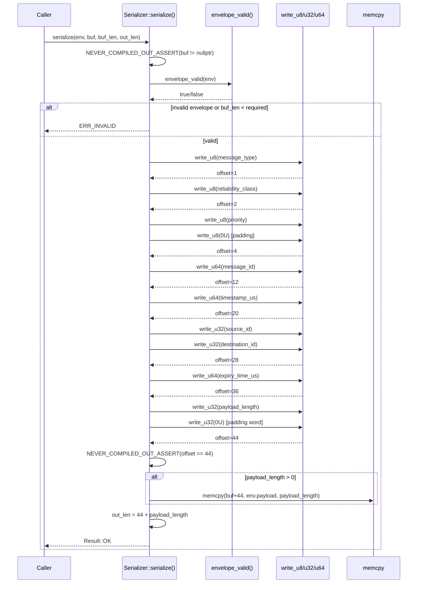

# UC_25 — Serializer encode

**HL Group:** System Internal — sub-function of HL-1 (best-effort send), HL-2 (reliable-with-ACK send), HL-3 (reliable-with-retry send), and HL-17 (UDP send)

**Actor:** System (internal sub-function)

**Requirement traceability:** REQ-3.2.3, REQ-4.1.2, REQ-6.1.5, REQ-6.2.3, REQ-6.3.5

---

## 1. Use Case Overview

### Invoked by
This use case documents the internal mechanism implemented by `Serializer::serialize()`. It is
invoked on every outbound message path before bytes are written to the network. Confirmed callers:

- `TcpBackend::send_message()` (TcpBackend.cpp:354) — called on the main outbound message
  immediately before `tcp_send_frame()` writes the framed bytes to the socket.
- `TcpBackend::flush_delayed_to_clients()` (TcpBackend.cpp:293) — re-serializes each
  impairment-delayed envelope when its `release_us` has elapsed, immediately before
  `tcp_send_frame()` sends it.
- `UdpBackend::send_message()` (UdpBackend.cpp:112) — encodes the main outbound message
  before `socket_send_to()`.
- `UdpBackend::send_message()` delayed-envelope loop (UdpBackend.cpp:147) — re-encodes
  delayed envelopes drained from the impairment engine.

It is factored out as a distinct mechanism because `Serializer::serialize()` is the single
authoritative transformation from the in-memory `MessageEnvelope` representation to the
big-endian binary wire format. Both TCP and UDP transports invoke it identically; the framing
layer (TCP length-prefix or UDP datagram boundary) is applied by the caller after `serialize()`
returns. Separating this concern means the wire format is defined and validated in exactly one
place (Serializer.cpp), independent of transport mechanics.

### Name
UC_25 — Serializer Encodes a MessageEnvelope into a Big-Endian Wire Buffer

### Actor
Any transport-layer caller with a valid `MessageEnvelope` and a destination byte buffer.
Confirmed callers: `TcpBackend::send_message()` (TcpBackend.cpp:354),
`TcpBackend::flush_delayed_to_clients()` (TcpBackend.cpp:293),
`UdpBackend::send_message()` (UdpBackend.cpp:112),
`UdpBackend::send_message()` delayed-envelope loop (UdpBackend.cpp:147).

### Goal
Convert an in-memory `MessageEnvelope` struct into a fixed-layout, big-endian binary wire
buffer. Produce a 44-byte header followed by the payload bytes. No heap allocation. Fully
deterministic: the same envelope always produces the same bit pattern, regardless of host
endianness.

### Preconditions
- `envelope_valid(env) == true`.
- `buf != nullptr`.
- `buf_len >= WIRE_HEADER_SIZE + env.payload_length`.

### Postconditions (success path)
- `buf[0..43]` contains the 44-byte header in big-endian wire format.
- `buf[44..44+payload_length-1]` contains verbatim payload bytes.
- `out_len == WIRE_HEADER_SIZE + env.payload_length`.
- `Result::OK` returned.

### Error path
- `!envelope_valid(env)` or `buf_len < required`: `Result::ERR_INVALID`, buf unmodified,
  `out_len` not written.

---

## 2. Entry Points

Primary entry point:
```
static Result Serializer::serialize(
    const MessageEnvelope& env,    // [in]  envelope to encode
    uint8_t*               buf,    // [out] caller-provided destination buffer
    uint32_t               buf_len,   // [in]  available bytes in buf
    uint32_t&              out_len    // [out] bytes written on success
)
```
Defined: Serializer.cpp, line 117.

Confirmed callers:

| Caller | File | Line | Context |
|--------|------|------|---------|
| `TcpBackend::send_message()` | `src/platform/TcpBackend.cpp` | 354 | Encodes main outbound message into `m_wire_buf` before `tcp_send_frame()` |
| `TcpBackend::flush_delayed_to_clients()` | `src/platform/TcpBackend.cpp` | 293 | Re-serializes each matured delayed envelope before `tcp_send_frame()` |
| `UdpBackend::send_message()` | `src/platform/UdpBackend.cpp` | 112 | Encodes main outbound message into `m_wire_buf` before `socket_send_to()` |
| `UdpBackend::send_message()` delayed-loop | `src/platform/UdpBackend.cpp` | 147 | Re-encodes delayed messages drained from the impairment engine |

Private helper entry points (called only by `serialize()`):

| Helper | File | Line |
|--------|------|------|
| `Serializer::write_u8` | `Serializer.cpp` | 24 |
| `Serializer::write_u32` | `Serializer.cpp` | 35 |
| `Serializer::write_u64` | `Serializer.cpp` | 50 |

Supporting function called before field writes:

| Function | File | Line |
|----------|------|------|
| `envelope_valid()` | `MessageEnvelope.hpp` | 63 |

---

## 3. End-to-End Control Flow (Step-by-Step)

**Step 1 — Caller prepares a MessageEnvelope** (caller context)
The calling transport layer populates a `MessageEnvelope` (stack or static buffer), then calls
`Serializer::serialize()` with a destination buffer pointer and its capacity. No special
initialization of the destination buffer is needed; all bytes up to `out_len` are overwritten.

**Step 2 — Precondition assertions** (Serializer.cpp:123–124)
```
NEVER_COMPILED_OUT_ASSERT(buf != nullptr)
NEVER_COMPILED_OUT_ASSERT(buf_len <= 0xFFFFFFFFUL)
```
`NEVER_COMPILED_OUT_ASSERT` fires unconditionally regardless of NDEBUG. A null buf causes
immediate program termination at the assert site in all build configurations.

**Step 3 — Envelope validation gate** (Serializer.cpp:127–129)
```
if (!envelope_valid(env)) return Result::ERR_INVALID
```
`envelope_valid()` (MessageEnvelope.hpp:63) checks:
- `env.message_type != MessageType::INVALID` (INVALID == 255U)
- `env.payload_length <= MSG_MAX_PAYLOAD_BYTES` (4096U)
- `env.source_id != NODE_ID_INVALID` (0U)

If any condition fails: returns `ERR_INVALID`; no bytes written to `buf`; `out_len` is not
written.

**Step 4 — Buffer size check** (Serializer.cpp:132–135)
```
required_len = WIRE_HEADER_SIZE + env.payload_length  = 44U + payload_length
if (buf_len < required_len): return Result::ERR_INVALID
```
No bytes written to `buf`; `out_len` not written.

**Step 5 — Offset cursor initialized** (Serializer.cpp:138)
```
uint32_t offset = 0U
```
This cursor advances by the return value of each helper call. It is the sole state variable
for the encoding pass.

**Step 6 — Header encoding, field by field** (Serializer.cpp:141–152)
All writes use private helper functions. Each helper returns the new offset, which is
immediately assigned back.

- 6a. `write_u8(buf, offset=0, env.message_type as uint8_t)` — writes buf[0]; offset = 1.
  Possible values: DATA=0x00, ACK=0x01, NAK=0x02, HEARTBEAT=0x03.
- 6b. `write_u8(buf, offset=1, env.reliability_class as uint8_t)` — buf[1]; offset = 2.
  Values: BEST_EFFORT=0x00, RELIABLE_ACK=0x01, RELIABLE_RETRY=0x02.
- 6c. `write_u8(buf, offset=2, env.priority)` — buf[2]; offset = 3.
- 6d. `write_u8(buf, offset=3, 0U)` — padding byte, hard-coded 0; buf[3]; offset = 4.
- 6e. `write_u64(buf, offset=4, env.message_id)` — big-endian 8 bytes: buf[4..11]; offset = 12.
- 6f. `write_u64(buf, offset=12, env.timestamp_us)` — buf[12..19]; offset = 20.
- 6g. `write_u32(buf, offset=20, env.source_id)` — buf[20..23]; offset = 24.
- 6h. `write_u32(buf, offset=24, env.destination_id)` — buf[24..27]; offset = 28.
- 6i. `write_u64(buf, offset=28, env.expiry_time_us)` — buf[28..35]; offset = 36.
- 6j. `write_u32(buf, offset=36, env.payload_length)` — buf[36..39]; offset = 40.
- 6k. `write_u32(buf, offset=40, 0U)` — padding word, hard-coded 0; buf[40..43]; offset = 44.

**Step 7 — Header size assertion** (Serializer.cpp:155)
```
NEVER_COMPILED_OUT_ASSERT(offset == WIRE_HEADER_SIZE)
```
i.e., `NEVER_COMPILED_OUT_ASSERT(44 == 44)`. Always active. If `WIRE_HEADER_SIZE` is ever
changed without updating the write sequence, this fires.

**Step 8 — Payload copy** (Serializer.cpp:159–161)
```
if (env.payload_length > 0U):
    (void)memcpy(&buf[44], env.payload, env.payload_length)
```
If `payload_length == 0`: branch is skipped; no memcpy. Payload bytes are copied verbatim
with no byte-order transformation (payload is declared opaque at CLAUDE.md §3.1). The `(void)`
cast is intentional: `memcpy`'s return value (dst pointer) carries no error information.

**Step 9 — out_len assignment** (Serializer.cpp:163)
```
out_len = required_len = WIRE_HEADER_SIZE + env.payload_length
```
Only write to caller's `out_len` reference. Not written on any error path.

**Step 10 — Post-condition assertion** (Serializer.cpp:166)
```
NEVER_COMPILED_OUT_ASSERT(out_len == WIRE_HEADER_SIZE + env.payload_length)
```
Redundant by construction but required by Power of 10 Rule 5 (≥2 assertions per function).
Always active regardless of NDEBUG.

**Step 11 — Return `Result::OK`** (Serializer.cpp:168)

---

## 4. Call Tree (Hierarchical)

```
Serializer::serialize(env, buf, buf_len, out_len)    [Serializer.cpp:117]
├── NEVER_COMPILED_OUT_ASSERT(buf != nullptr)
├── NEVER_COMPILED_OUT_ASSERT(buf_len <= 0xFFFFFFFFUL)
├── envelope_valid(env)                               [MessageEnvelope.hpp:63]
│   ├── env.message_type != INVALID (255U)
│   ├── env.payload_length <= 4096U
│   └── env.source_id != 0U
│   [if false] return ERR_INVALID
├── [buf_len < 44 + payload_length] return ERR_INVALID
├── write_u8(buf, 0, message_type)                   [Serializer.cpp:24]
│   └── buf[0] = val; return 1
├── write_u8(buf, 1, reliability_class)              [Serializer.cpp:24]
├── write_u8(buf, 2, priority)                       [Serializer.cpp:24]
├── write_u8(buf, 3, 0U)                             [Serializer.cpp:24]
├── write_u64(buf, 4, message_id)                    [Serializer.cpp:50]
│   └── buf[4..11] = 8-byte big-endian; return 12
├── write_u64(buf, 12, timestamp_us)                 [Serializer.cpp:50]
│   └── buf[12..19]; return 20
├── write_u32(buf, 20, source_id)                    [Serializer.cpp:35]
│   └── buf[20..23]; return 24
├── write_u32(buf, 24, destination_id)               [Serializer.cpp:35]
├── write_u64(buf, 28, expiry_time_us)               [Serializer.cpp:50]
├── write_u32(buf, 36, payload_length)               [Serializer.cpp:35]
├── write_u32(buf, 40, 0U)                           [Serializer.cpp:35]
├── NEVER_COMPILED_OUT_ASSERT(offset == 44U)
├── [payload_length > 0U] (void)memcpy(&buf[44], env.payload, payload_length)
├── out_len = 44 + payload_length
└── NEVER_COMPILED_OUT_ASSERT(out_len == 44 + payload_length)
    return Result::OK
```

---

## 5. Key Components Involved

| Component | File(s) | Role |
|-----------|---------|------|
| `Serializer` | `src/core/Serializer.cpp / .hpp` | Non-instantiable static utility class. All methods are static. `WIRE_HEADER_SIZE = 44U` defined at `.hpp:47`. |
| `MessageEnvelope` | `src/core/MessageEnvelope.hpp` | Input data structure passed by const reference. Payload is `uint8_t payload[4096U]` inline — fixed size. |
| `envelope_valid()` | `src/core/MessageEnvelope.hpp:63` | Inline free function. Acts as a precondition gate; three-condition check. |
| `write_u8()` | `Serializer.cpp:24` | Private static inline helper. Single write of one byte; no loops; returns new offset. |
| `write_u32()` | `Serializer.cpp:35` | Private static inline helper. Four manual bit-shift stores in big-endian order. |
| `write_u64()` | `Serializer.cpp:50` | Private static inline helper. Eight manual bit-shift stores in big-endian order. |
| `memcpy` | `<cstring>` | Bounded opaque payload copy. Return value void-cast. |
| `Types.hpp` | `src/core/Types.hpp` | `MSG_MAX_PAYLOAD_BYTES=4096U`, `NODE_ID_INVALID=0U`, `MessageType` enum, `ReliabilityClass` enum, `Result` enum. |

---

## 6. Branching Logic / Decision Points

| Branch | Condition | True path | False path |
|--------|-----------|-----------|------------|
| Envelope validation | `!envelope_valid(env)` | Return `ERR_INVALID`; no writes; `out_len` untouched | Proceed to buffer size check |
| Buffer size | `buf_len < (44U + env.payload_length)` | Return `ERR_INVALID`; no writes; `out_len` untouched | Proceed to header encoding |
| Payload copy guard | `env.payload_length > 0U` | Execute `memcpy` of `payload_length` bytes from `env.payload` into `buf[44]` | Skip `memcpy` (zero-length payload is valid) |

No other branches in the happy path. The 11 write calls are unconditional sequential
statements. No loops, no switches, no recursion.

---

## 7. Concurrency / Threading Behavior

`Serializer::serialize()` is a purely functional static method with no shared state. It has no
class-level mutable variables, no globals, and no static locals.

Thread safety: `serialize()` is fully re-entrant and can be called from multiple threads
simultaneously without synchronization, provided each call uses a distinct `(env, buf)` pair.
The `env` is passed by const reference (read-only), and `buf` is an exclusive caller-provided
output buffer.

In `TcpBackend`, both `send_message()` (TcpBackend.cpp:354) and `flush_delayed_to_clients()`
(TcpBackend.cpp:293) pass the same `m_wire_buf` member array to `serialize()`. If both are
called from different threads on the same `TcpBackend` instance, they would race on `m_wire_buf`.
No mutex protects `m_wire_buf`. Currently the send path is single-threaded per `TcpBackend`
instance; this is only a risk under future concurrent access.

Similarly for `UdpBackend`: two concurrent `send_message()` calls on the same instance would race
on `m_wire_buf` at UdpBackend.cpp:112 and UdpBackend.cpp:147.

Within `serialize()` itself: no atomic operations, no locks, no condition variables.

---

## 8. Memory & Ownership Semantics

| Object | Ownership | Notes |
|--------|-----------|-------|
| `env (const MessageEnvelope&)` | Caller | Passed by const reference; borrowed read-only; lifetime must exceed the call; pointer not retained after return |
| `buf (uint8_t*)` | Caller | Raw pointer to caller-provided buffer; `Serializer` writes but does not own or free it; at `TcpBackend::send_message()` this is `m_wire_buf` (8192 bytes, inline member) |
| `out_len (uint32_t&)` | Caller | Non-const reference; written exactly once at line 163; not written on error paths; caller should initialize to 0 before call |
| `required_len` (local uint32_t) | Stack | Computed as `WIRE_HEADER_SIZE + env.payload_length`; also used as final `out_len` value; discarded on return |
| `offset` (local uint32_t) | Stack | Write cursor; advances monotonically 0→44; discarded on return |

No heap allocation anywhere in this call tree. The fixed `WIRE_HEADER_SIZE = 44U` is a static
const class member of `Serializer` (Serializer.hpp:47); it has no storage allocation at runtime.

---

## 9. Error Handling Flow

```
serialize()
  buf == nullptr              → NEVER_COMPILED_OUT_ASSERT fires; program terminates (all builds)
  !envelope_valid(env)        → return ERR_INVALID; buf unmodified; out_len not written
  buf_len < required_len      → return ERR_INVALID; buf unmodified; out_len not written
  offset != 44 after writes   → NEVER_COMPILED_OUT_ASSERT fires; program terminates (all builds)
  out_len mismatch            → NEVER_COMPILED_OUT_ASSERT fires; program terminates (all builds)
  success                     → return OK; buf[0..out_len-1] written; out_len set
```

Caller responsibility: check the return value (Power of 10 Rule 7).
`TcpBackend::send_message()` (TcpBackend.cpp:356) tests `result_ok(res)` before calling
`tcp_send_frame()`. `UdpBackend::send_message()` (line 114) also tests `result_ok(res)`.

---

## 10. External Interactions

`memcpy` (`<cstring>`, Serializer.cpp:160): the only external function called. Used only for
the opaque payload copy. All header field writes are done with explicit array subscripts and
manual bit shifts.

No file I/O. No socket calls. No OS calls. No dynamic memory. No global variables read or
written. No logging calls within `serialize()` itself.

The function is entirely self-contained at the core layer, with no dependency on the platform
or app layers, consistent with CLAUDE.md §3 (architecture layering).

---

## 11. State Changes / Side Effects

### Outputs written (success path)

| Byte range | Content |
|------------|---------|
| `buf[0]` | `message_type` (1 byte) |
| `buf[1]` | `reliability_class` (1 byte) |
| `buf[2]` | `priority` (1 byte) |
| `buf[3]` | padding = 0x00 (1 byte) |
| `buf[4..11]` | `message_id` (big-endian uint64) |
| `buf[12..19]` | `timestamp_us` (big-endian uint64) |
| `buf[20..23]` | `source_id` (big-endian uint32) |
| `buf[24..27]` | `destination_id` (big-endian uint32) |
| `buf[28..35]` | `expiry_time_us` (big-endian uint64) |
| `buf[36..39]` | `payload_length` (big-endian uint32) |
| `buf[40..43]` | padding = 0x00000000 (4 bytes) |
| `buf[44..44+n-1]` | verbatim payload bytes (if `payload_length > 0`) |
| `out_len` | set to `44 + payload_length` |

No state changes within `Serializer` or any other object. `serialize()` has no side effects
beyond writing to its output parameters. The input envelope is not modified.

---

## 12. Sequence Diagram



---

## 13. Initialization vs Runtime Flow

### Initialization phase
No initialization is required for `Serializer`. The class has no constructor, no static
mutable state, and no `init()` method. `WIRE_HEADER_SIZE = 44U` is a static const class member
(Serializer.hpp:47), initialized at compile time.

### Runtime phase
`serialize()` is called once per outbound message. Execution is strictly linear: assertions →
validation → header writes → payload copy → return. No persistent state between calls. No side
effects on any object other than `buf` and `out_len`.

Typical hot path (valid envelope, sufficient buffer): 11 inline helper calls, each compiling
to 1–8 store instructions, plus one conditional `memcpy`.

---

## 14. Known Risks / Observations

### Risk 1 — Padding validation asymmetry
`serialize()` writes padding bytes as hard-coded 0. `deserialize()` validates them and returns
`ERR_INVALID` if non-zero. A sender that writes non-zero padding (e.g., a buggy third-party
implementation) is rejected on the receive side. This is intentional defense-in-depth, but
creates an implicit coupling between the encode and decode contracts.

### Risk 2 — buf_len accepted without upper bound check
The `NEVER_COMPILED_OUT_ASSERT` at line 124 checks `buf_len <= 0xFFFFFFFFUL`, which is always
true for a `uint32_t` and therefore a tautology. If a caller passes a fraudulently large
`buf_len` (larger than the actual buffer), the `required_len` check at line 133 may pass, and
`memcpy` at line 160 may overwrite memory beyond the actual buffer. The assertion provides no
real protection against callers that lie about `buf_len`.

### Risk 3 — NEVER_COMPILED_OUT_ASSERT is always active
Unlike standard `assert()` which is removed under NDEBUG, `NEVER_COMPILED_OUT_ASSERT` fires
unconditionally in all builds. A null `buf` passed to `serialize()` will terminate the program
in production. This is the intended safety posture (Power of 10 Rule 5), but callers must
never pass `nullptr`.

### Risk 4 — `(void)` cast on `memcpy`
The return value of `memcpy` is explicitly discarded with `(void)`. This is correct because
`memcpy`'s return (the dst pointer) carries no error information. Static analysis tools
configured for "check all returns" may flag this; the `(void)` cast is the MISRA-approved
suppression.

### Risk 5 — No protocol version field
The wire header has no version byte. If the wire format changes, there is no mechanism for a
receiver to detect a version mismatch. The hard-coded padding bytes and `WIRE_HEADER_SIZE`
constant provide a limited structural sanity check but do not constitute a versioning scheme.

### Risk 6 — Shared `m_wire_buf` across serialize calls in TcpBackend
`TcpBackend::send_message()` (TcpBackend.cpp:354) and `flush_delayed_to_clients()`
(TcpBackend.cpp:293) both pass `m_wire_buf` to `serialize()`. In the current single-threaded
design these are never concurrent. A future refactor allowing concurrent sends would race on
`m_wire_buf` — no mutex protects it.

---

## 15. Unknowns / Assumptions

**[CONFIRMED-1]** `WIRE_HEADER_SIZE = 44U` is defined as `static const uint32_t WIRE_HEADER_SIZE = 44U`
in Serializer.hpp:47. Derivation: 1+1+1+1+8+8+4+4+8+4+4 = 44 bytes.

**[CONFIRMED-2]** `NEVER_COMPILED_OUT_ASSERT` is defined in `core/Assert.hpp` and fires
unconditionally regardless of NDEBUG. It is not the standard `assert()` macro.

**[CONFIRMED-3]** `envelope_valid()` is defined inline in MessageEnvelope.hpp:63:
checks `message_type != INVALID (255U)`, `payload_length <= 4096U`, `source_id != 0U`.

**[CONFIRMED-4]** `MSG_MAX_PAYLOAD_BYTES = 4096U`, `NODE_ID_INVALID = 0U` confirmed in
Types.hpp. The payload field is `uint8_t payload[MSG_MAX_PAYLOAD_BYTES]` inline.

**[CONFIRMED-5]** The helpers `write_u8`, `write_u32`, `write_u64` are declared inline and use
`NEVER_COMPILED_OUT_ASSERT` internally (not standard `assert`). They are at Serializer.cpp lines
24, 35, 50 respectively.

**[CONFIRMED-6]** `TcpBackend::send_message()` calls `Serializer::serialize()` at TcpBackend.cpp:354
and `TcpBackend::flush_delayed_to_clients()` calls it at TcpBackend.cpp:293. Both pass
`m_wire_buf` as the destination buffer. The ASSUMPTION-A label from the prior version of this
document is hereby retired — TcpBackend is a confirmed caller.

**[ASSUMPTION-B]** The compiler inlines `write_u8`/`u32`/`u64` under -O1 or higher. The `inline`
keyword is a hint; the actual inlining decision is compiler-dependent. At -O0 these would be
actual function calls, adding frame overhead per field.

**[ASSUMPTION-C]** The caller initializes `out_len` to 0 or a known value before calling
`serialize()`, so that on `ERR_INVALID` return (where `out_len` is not written) the caller does
not act on garbage. No enforcement of this contract exists in `serialize()` itself.
