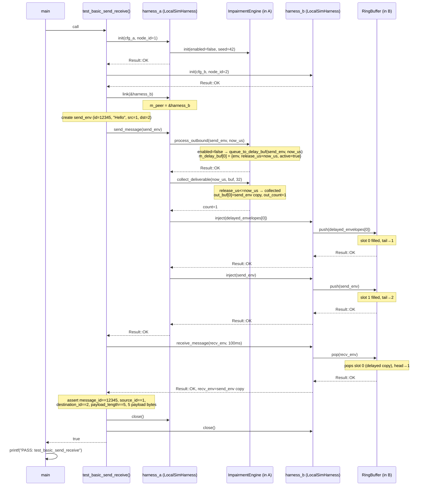

# UC_30 — LocalSimHarness round-trip test

**HL Group:** HL-14 — User links two in-process endpoints
**Actor:** Test function (`test_basic_send_receive()` in `tests/test_LocalSim.cpp`)
**Requirement traceability:** REQ-4.1.2, REQ-4.1.3, REQ-5.3.2

---

## 1. Use Case Overview

**Trigger:** `main()` calls `test_basic_send_receive()` as the first test case (`tests/test_LocalSim.cpp`, line 258).

**Precondition:** No real network exists. Two `LocalSimHarness` objects are stack-allocated inside the test function. No threads have been started; the entire test executes single-threaded. The impairment engine is initialized with `enabled=false` (default configuration).

**Postcondition:** `harness_a` successfully delivered a `"Hello"` DATA envelope to `harness_b`. All envelope fields (`message_id`, `source_id`, `destination_id`, `payload_length`, payload bytes) compare equal between the sent and received copies. Both harnesses are closed and the test function returns `true`.

**Scope:** In-process simulation only. No sockets, no OS network stack, no threads. The test exercises `LocalSimHarness::send_message()` → `ImpairmentEngine::process_outbound()` / `collect_deliverable()` → `inject()` × 2 → `receive_message()` → `RingBuffer::pop()`.

**Note on double injection:** When the impairment engine is disabled (`enabled=false`), `send_message()` enqueues the envelope into the delay buffer with `release_us = now_us`, meaning it is immediately deliverable. `collect_deliverable()` retrieves it (count=1), injects it as `delayed_envelopes[0]` into the peer's `RingBuffer` (slot 0), and then the original envelope is injected a second time (slot 1). The receiver's queue therefore contains two identical copies. `receive_message()` pops slot 0 and returns immediately; slot 1 remains unconsumed.

---

## 2. Entry Points

| Symbol | File | Line |
|---|---|---|
| `test_basic_send_receive()` | `tests/test_LocalSim.cpp` | 68 |
| `create_local_sim_config(cfg, node_id)` | `tests/test_LocalSim.cpp` | 29 |
| `create_test_data_envelope(env, src, dst, payload)` | `tests/test_LocalSim.cpp` | 40 |
| `LocalSimHarness::init(config)` | `src/platform/LocalSimHarness.cpp` | 48 |
| `LocalSimHarness::link(peer)` | `src/platform/LocalSimHarness.cpp` | 78 |
| `LocalSimHarness::send_message(envelope)` | `src/platform/LocalSimHarness.cpp` | 109 |
| `LocalSimHarness::inject(envelope)` | `src/platform/LocalSimHarness.cpp` | 91 |
| `LocalSimHarness::receive_message(envelope, timeout_ms)` | `src/platform/LocalSimHarness.cpp` | 147 |
| `LocalSimHarness::close()` | `src/platform/LocalSimHarness.cpp` | 192 |
| `ImpairmentEngine::process_outbound(env, now_us)` | `src/platform/ImpairmentEngine.cpp` | 151 |
| `ImpairmentEngine::collect_deliverable(now_us, buf, cap)` | `src/platform/ImpairmentEngine.cpp` | 216 |
| `ImpairmentEngine::queue_to_delay_buf(env, release_us)` | `src/platform/ImpairmentEngine.cpp` | 83 |
| `RingBuffer::push(env)` | `src/core/RingBuffer.hpp` | — |
| `RingBuffer::pop(env)` | `src/core/RingBuffer.hpp` | — |
| `timestamp_now_us()` | `src/core/Timestamp.cpp` | — |

---

## 3. End-to-End Control Flow (Step-by-Step)

### Phase 1 — Object Construction

**Step 1.1** `LocalSimHarness harness_a;` constructed on the stack. [`test_LocalSim.cpp:71`]
Constructor [`LocalSimHarness.cpp:27–32`]:
- `m_peer = nullptr` (member initializer)
- `m_open = false` (member initializer)
- `NEVER_COMPILED_OUT_ASSERT(!m_open)` [line 31]

**Step 1.2** `LocalSimHarness harness_b;` constructed identically. [`test_LocalSim.cpp:72`]

### Phase 2 — Initialize harness_a

**Step 2.1** `create_local_sim_config(cfg_a, 1U)` called. [`test_LocalSim.cpp:75`]
Inside `create_local_sim_config()` [line 29]:
- `transport_config_default(cfg)` — sets TCP defaults (zero-fills struct, sets port=9000, ip="127.0.0.1", timeout=5000ms, node_id=1)
- `cfg.kind = TransportKind::LOCAL_SIM`
- `cfg.local_node_id = 1U`
- `cfg.is_server = false`

**Step 2.2** `harness_a.init(cfg_a)` called. [`test_LocalSim.cpp:77`]
Inside `LocalSimHarness::init(config)` [line 48]:
- a. `NEVER_COMPILED_OUT_ASSERT(config.kind == TransportKind::LOCAL_SIM)` [line 50] — passes
- b. `NEVER_COMPILED_OUT_ASSERT(!m_open)` [line 51] — passes (m_open=false)
- c. `m_recv_queue.init()` [line 54] — resets `RingBuffer` atomic head and tail to 0
- d. `ImpairmentConfig imp_cfg` declared [line 57]
- e. `impairment_config_default(imp_cfg)` [line 58] — sets `imp_cfg.enabled=false`, `prng_seed=42ULL`, all impairments zeroed/false
- f. `if (config.num_channels > 0U)` [line 59] — `num_channels==0` in default config → condition false → `imp_cfg.enabled` stays `false`
- g. `m_impairment.init(imp_cfg)` [line 62]:
  - Asserts preconditions; copies config; resolves seed (42ULL, non-zero → used directly); `m_prng.seed(42ULL)`; `memset` both buffers; `m_initialized=true`
- h. `m_open = true` [line 64]
- i. `Logger::log(INFO, "LocalSimHarness", "Local simulation harness initialized (node %u)", 1U)` [lines 65–67]
- j. `NEVER_COMPILED_OUT_ASSERT(m_open)` [line 69] — passes
- Returns `Result::OK`

**Step 2.3** `assert(init_a == Result::OK)` [test line 78]
**Step 2.4** `assert(harness_a.is_open() == true)` [test line 79] — `is_open()` returns `m_open` (true)

### Phase 3 — Initialize harness_b

**Step 3.1** `create_local_sim_config(cfg_b, 2U)` [test line 81] — same as Phase 2, `node_id=2`
**Step 3.2** `harness_b.init(cfg_b)` [test line 83] — same as Step 2.2 with `node_id=2`
**Step 3.3** `assert(init_b == Result::OK)` [test line 84]
**Step 3.4** `assert(harness_b.is_open() == true)` [test line 85]

### Phase 4 — Link

**Step 4.1** `harness_a.link(&harness_b)` [test line 88]
Inside `LocalSimHarness::link(peer)` [line 78]:
- `NEVER_COMPILED_OUT_ASSERT(peer != nullptr)` [line 80] — passes
- `NEVER_COMPILED_OUT_ASSERT(peer != this)` [line 81] — passes
- `m_peer = &harness_b` [line 83]
- `Logger::log(INFO, "LocalSimHarness", "Harness linked to peer")`

Note: `harness_b.m_peer` is **not** set. This is a unidirectional link. Messages from A go to B; the reverse direction is not needed for this test.

### Phase 5 — Build the Envelope

**Step 5.1** `MessageEnvelope send_env;` declared on the stack. [test line 91]
**Step 5.2** `create_test_data_envelope(send_env, 1U, 2U, "Hello")` [test line 92]
Inside `create_test_data_envelope()` [line 40]:
- `envelope_init(env)` — zeroes/initializes all envelope fields
- `env.message_type = MessageType::DATA`
- `env.message_id = 12345ULL` (hardcoded test ID)
- `env.timestamp_us = 0ULL`
- `env.source_id = 1U`
- `env.destination_id = 2U`
- `env.priority = 0U`
- `env.reliability_class = ReliabilityClass::BEST_EFFORT`
- `env.expiry_time_us = 0ULL`
- Payload copy loop (bounded by `MSG_MAX_PAYLOAD_BYTES=4096`): copies `'H','e','l','l','o'` (5 bytes) into `env.payload[]`
- `env.payload_length = 5U`

### Phase 6 — Send

**Step 6.1** `harness_a.send_message(send_env)` called. [test line 94]
Inside `LocalSimHarness::send_message(envelope)` [line 109]:

**Step 6.1a** Precondition assertions:
- `NEVER_COMPILED_OUT_ASSERT(m_open)` [line 111] — true
- `NEVER_COMPILED_OUT_ASSERT(m_peer != nullptr)` [line 112] — `&harness_b`
- `NEVER_COMPILED_OUT_ASSERT(envelope_valid(envelope))` [line 113] — passes

**Step 6.1b** `now_us = timestamp_now_us()` [line 116] — current monotonic microseconds from POSIX clock.

**Step 6.1c** `m_impairment.process_outbound(envelope, now_us)` [line 117]
Inside `ImpairmentEngine::process_outbound(in_env, now_us)` [line 151]:
- Precondition assertions: `m_initialized` and `envelope_valid(in_env)` [lines 155–156] — both pass
- Check `m_cfg.enabled` [line 159]: `enabled == false` → **disabled path taken**
- Disabled path [lines 160–166]:
  - `m_delay_count >= IMPAIR_DELAY_BUF_SIZE` → `0 >= 32` → false → ERR_FULL not returned
  - Calls `queue_to_delay_buf(in_env, now_us)` [line 165]
- Inside `queue_to_delay_buf(env, release_us)` [line 83]:
  - `NEVER_COMPILED_OUT_ASSERT(m_initialized)` [line 86] — passes
  - `NEVER_COMPILED_OUT_ASSERT(m_delay_count < IMPAIR_DELAY_BUF_SIZE)` [line 87] — passes
  - Loop over `IMPAIR_DELAY_BUF_SIZE` slots [line 90]: `i=0` — `m_delay_buf[0].active == false` → slot chosen
    - `envelope_copy(m_delay_buf[0].env, env)` [line 92]
    - `m_delay_buf[0].release_us = now_us` [line 93] — **set to now_us → immediately deliverable**
    - `m_delay_buf[0].active = true` [line 94]
    - `++m_delay_count` → `m_delay_count = 1` [line 95]
    - `NEVER_COMPILED_OUT_ASSERT(m_delay_count <= IMPAIR_DELAY_BUF_SIZE)` [line 96] — passes
    - Returns `Result::OK`
- `queue_to_delay_buf()` returns `Result::OK`; `process_outbound()` returns `Result::OK`

**Step 6.1d** Check `process_outbound` result [line 118]:
- `res == Result::OK` (not `ERR_IO`) → execution continues; message not dropped.

**Step 6.1e** Collect delayed messages [lines 124–127]:
- `MessageEnvelope delayed_envelopes[IMPAIR_DELAY_BUF_SIZE]` allocated on stack
- `delayed_count = m_impairment.collect_deliverable(now_us, delayed_envelopes, IMPAIR_DELAY_BUF_SIZE)`
- Inside `ImpairmentEngine::collect_deliverable(now_us, out_buf, buf_cap)` [line 216]:
  - Precondition assertions [lines 221–223]: all pass
  - `out_count = 0U` [line 225]
  - Loop over `IMPAIR_DELAY_BUF_SIZE` [line 228]:
    - `i=0`: `m_delay_buf[0].active == true`; `release_us == now_us` → `release_us <= now_us` → **true → slot deliverable**
      - `envelope_copy(out_buf[0], m_delay_buf[0].env)` [line 231]
      - `++out_count` → `out_count = 1` [line 232]
      - `m_delay_buf[0].active = false` [line 235]
      - `NEVER_COMPILED_OUT_ASSERT(m_delay_count > 0U)` [line 236] — passes
      - `--m_delay_count` → `m_delay_count = 0` [line 237]
    - `i=1..31`: `active == false` → skipped
  - Postcondition assertions [lines 242–243]: pass
  - Returns `out_count = 1`
- `delayed_count = 1`

**Step 6.1f** Inject delayed messages into peer [lines 131–134] — bounded loop over `delayed_count=1`:
- `NEVER_COMPILED_OUT_ASSERT(i < IMPAIR_DELAY_BUF_SIZE)` [line 132] — passes
- `(void)m_peer->inject(delayed_envelopes[0])` [line 133] — calls `harness_b.inject(delayed_envelopes[0])`
- Inside `harness_b.inject(envelope)` [line 91]:
  - `NEVER_COMPILED_OUT_ASSERT(m_open)` [line 93] — passes
  - `m_recv_queue.push(envelope)` — copies envelope into `m_buf[0]`; `m_tail` advances 0→1; returns `Result::OK`
  - Returns `Result::OK`
- **Result: `delayed_envelopes[0]` (copy of `send_env`) is now in `harness_b.m_recv_queue` at slot 0.**

**Step 6.1g** Inject the original envelope into peer [line 137]:
- `res = m_peer->inject(envelope)` — calls `harness_b.inject(send_env)`
- Inside `harness_b.inject(send_env)` [line 91]:
  - `NEVER_COMPILED_OUT_ASSERT(m_open)` — passes
  - `m_recv_queue.push(send_env)` — copies `send_env` into `m_buf[1]`; `m_tail` advances 1→2; returns `Result::OK`
  - Returns `Result::OK`
- **Result: `send_env` is now in `harness_b.m_recv_queue` at slot 1. Queue contains 2 items.**

**Step 6.1h** `send_message()` postcondition [line 139]:
- `NEVER_COMPILED_OUT_ASSERT(res == OK || res == ERR_FULL)` — passes
- Returns `Result::OK`

**Step 6.2** `assert(send_r == Result::OK)` [test line 95]

### Phase 7 — Receive

**Step 7.1** `MessageEnvelope recv_env;` declared on the stack. [test line 98]
**Step 7.2** `harness_b.receive_message(recv_env, 100U)` called. [test line 99]
Inside `LocalSimHarness::receive_message(envelope, timeout_ms)` [line 147]:

**Step 7.2a** `NEVER_COMPILED_OUT_ASSERT(m_open)` [line 149] — passes

**Step 7.2b** First attempt to pop from queue (instant path) [line 152]:
- `res = m_recv_queue.pop(envelope)`
- Inside `RingBuffer::pop(envelope)`:
  - Queue has 2 items (`tail=2`, `head=0`)
  - Copies `m_buf[0]` (`delayed_envelopes[0]`, content-identical to `send_env`) into `recv_env`
  - `m_head` advances 0→1
  - Returns `Result::OK`

**Step 7.2c** `result_ok(res) == true` [line 153] → **immediate return with `Result::OK`** [line 154]

Note: slot 1 (`send_env` copy) remains in the queue unconsumed. The polling loop [lines 169–182] is never entered.

**Step 7.3** `assert(recv_r == Result::OK)` [test line 100]

### Phase 8 — Verify Fields

**Step 8.1** `assert(recv_env.message_id == send_env.message_id)` — both `12345ULL` — passes [test line 103]
**Step 8.2** `assert(recv_env.source_id == send_env.source_id)` — both `1U` — passes [test line 104]
**Step 8.3** `assert(recv_env.destination_id == send_env.destination_id)` — both `2U` — passes [test line 105]
**Step 8.4** `assert(recv_env.payload_length == send_env.payload_length)` — both `5U` — passes [test line 106]
**Step 8.5** Payload byte loop [test lines 109–111], bounded by `recv_env.payload_length`:
- `i=0..4`: `recv_env.payload[i] == send_env.payload[i]` for `'H','e','l','l','o'` — 5 assertions, all pass

### Phase 9 — Teardown

**Step 9.1** `harness_a.close()` [test line 113]
Inside `LocalSimHarness::close()` [line 192]:
- `m_peer = nullptr` [line 194]
- `m_open = false` [line 195]
- `Logger::log(INFO, "LocalSimHarness", "Transport closed")` [line 196]

**Step 9.2** `harness_b.close()` [test line 114] — identical. `harness_b.m_peer` was never set; setting it to `nullptr` is a no-op.

**Step 9.3** `return true` [test line 116]
**Step 9.4** `main()` [test line 258] prints `"PASS: test_basic_send_receive\n"`.

### Phase 10 — Stack Unwind (Destructor Execution)

**Step 10.1** `harness_b` goes out of scope; `LocalSimHarness::~LocalSimHarness()` [line 38–42] calls `close()` again:
- `m_peer = nullptr` (already null), `m_open = false` (already false)
- `Logger::log(INFO, ..., "Transport closed")` — harmless duplicate log

**Step 10.2** `harness_a` goes out of scope; same destructor pattern.

---

## 4. Call Tree (Hierarchical)

```
main()  [test_LocalSim.cpp:254]
  test_basic_send_receive()  [line 68]
    create_local_sim_config(cfg_a, 1U)  [line 29]
      transport_config_default(cfg)
    harness_a.init(cfg_a)  [LocalSimHarness.cpp:48]
      m_recv_queue.init()                              — RingBuffer
      impairment_config_default(imp_cfg)
      m_impairment.init(imp_cfg)                       — ImpairmentEngine.cpp:44
        m_prng.seed(42ULL)                             — PrngEngine.hpp:43
        memset(m_delay_buf, 0, ...)
        memset(m_reorder_buf, 0, ...)
      Logger::log(INFO, ...)
    create_local_sim_config(cfg_b, 2U)  [line 29]
    harness_b.init(cfg_b)               [same tree as harness_a.init]
    harness_a.link(&harness_b)          [LocalSimHarness.cpp:78]
    create_test_data_envelope(send_env, 1U, 2U, "Hello")  [line 40]
      envelope_init(env)
    harness_a.send_message(send_env)    [LocalSimHarness.cpp:109]
      timestamp_now_us()                               — Timestamp.cpp
      m_impairment.process_outbound(send_env, now_us)  — ImpairmentEngine.cpp:151
        queue_to_delay_buf(send_env, now_us)            — ImpairmentEngine.cpp:83
          envelope_copy(m_delay_buf[0].env, send_env)
      m_impairment.collect_deliverable(now_us, ..., 32) — ImpairmentEngine.cpp:216
        envelope_copy(out_buf[0], m_delay_buf[0].env)
      m_peer->inject(delayed_envelopes[0])             — LocalSimHarness.cpp:91 [harness_b]
        m_recv_queue.push(delayed_envelopes[0])         — RingBuffer: slot 0
      m_peer->inject(send_env)                         — LocalSimHarness.cpp:91 [harness_b]
        m_recv_queue.push(send_env)                     — RingBuffer: slot 1
    harness_b.receive_message(recv_env, 100U)  [LocalSimHarness.cpp:147]
      m_recv_queue.pop(recv_env)                        — RingBuffer: pops slot 0
    assert(recv_env.message_id == 12345ULL)
    assert(recv_env.source_id == 1U)
    assert(recv_env.destination_id == 2U)
    assert(recv_env.payload_length == 5U)
    [payload byte loop: 5 asserts]
    harness_a.close()  [LocalSimHarness.cpp:192]
    harness_b.close()  [LocalSimHarness.cpp:192]
    return true
```

---

## 5. Key Components Involved

| Component | File | Role in this flow |
|---|---|---|
| `test_basic_send_receive()` | `tests/test_LocalSim.cpp:68` | Test driver; stack-allocates two harnesses and validates end-to-end message delivery without a real network. |
| `LocalSimHarness` | `src/platform/LocalSimHarness.cpp/.hpp` | In-process `TransportInterface` implementation. Owns `m_recv_queue` (RingBuffer) and `m_impairment` (ImpairmentEngine). `send_message()` routes through impairment engine and calls `inject()` on the linked peer. |
| `ImpairmentEngine` | `src/platform/ImpairmentEngine.cpp/.hpp` | Applies configured faults between send and inject. In this test `enabled=false`; all messages pass through the delay buffer with `release_us=now_us` and are immediately collectible. |
| `RingBuffer` | `src/core/RingBuffer.hpp` | SPSC lock-free FIFO backed by `std::atomic<uint32_t>` head/tail with acquire/release ordering. Capacity `MSG_RING_CAPACITY=64` envelopes. Holds the two injected copies of `send_env`. |
| `MessageEnvelope` | `src/core/MessageEnvelope.hpp` | Standard message container: `message_id`, `source_id`, `destination_id`, `payload[MSG_MAX_PAYLOAD_BYTES=4096]`, `payload_length`, metadata fields. |
| `PrngEngine` | `src/platform/PrngEngine.hpp` | xorshift64 PRNG. Seeded with 42ULL during `init()`; not consumed in this test because impairments are disabled. |
| `timestamp_now_us()` | `src/core/Timestamp.cpp` | Returns current monotonic time in microseconds via POSIX `clock_gettime`. Used to set `release_us` in the delay buffer. |

---

## 6. Branching Logic / Decision Points

| # | Location | Condition | Path Taken | Effect |
|---|---|---|---|---|
| 1 | `LocalSimHarness::init()` line 59 | `config.num_channels > 0U` | `num_channels==0` → **false** | `imp_cfg.enabled` stays `false`; impairment disabled |
| 2 | `ImpairmentEngine::process_outbound()` line 159 | `!m_cfg.enabled` | `!false` → **true** | Disabled path taken; PRNG not consumed; direct queue to delay buffer |
| 3 | Disabled path line 160 | `m_delay_count >= IMPAIR_DELAY_BUF_SIZE` | `0 >= 32` → **false** | `ERR_FULL` not returned; continues to `queue_to_delay_buf()` |
| 4 | `queue_to_delay_buf()` line 91 | `!m_delay_buf[i].active` | `i=0`: `!false` → **true** | Slot 0 chosen; `release_us = now_us` → immediately deliverable |
| 5 | `collect_deliverable()` line 229 | `active && release_us <= now_us` | `true && now_us <= now_us` → **true** | Slot 0 collected; `out_count=1` |
| 6 | `send_message()` line 118 | `res == Result::ERR_IO` | `res==OK` → **false** | Message not dropped; execution continues to inject loop |
| 7 | `receive_message()` line 153 | `result_ok(res)` after first `pop()` | Queue has 2 items → pop succeeds → **true** | Returns `Result::OK` immediately; polling loop never entered |
| 8 | `main()` line 258 | `!test_basic_send_receive()` | Returns `true` → `!true` → **false** | PASS branch taken; `printf("PASS: ...")` |

---

## 7. Concurrency / Threading Behavior

The test is entirely single-threaded. No threads are created anywhere on this execution path.

`RingBuffer` uses `std::atomic<uint32_t>` for `m_head` and `m_tail` with acquire/release memory ordering to support SPSC (single-producer/single-consumer) use. In this test both producer (`inject()` via `send_message()`) and consumer (`pop()` via `receive_message()`) execute on the same thread. The acquire/release semantics provide correct visibility at negligible overhead.

`nanosleep()` is called inside `receive_message()` only if the first `pop()` fails. Because `send_message()` injects two copies before `receive_message()` is called, the queue is non-empty and the first pop succeeds immediately. `nanosleep()` is never reached.

No mutexes, condition variables, or semaphores are used anywhere on this path.

---

## 8. Memory and Ownership Semantics (C/C++ Specific)

All objects are automatic (stack) variables within `test_basic_send_receive()`.

Approximate stack layout inside `test_basic_send_receive()`:

| Object | Dominant size contributor | Approximate size |
|---|---|---|
| `LocalSimHarness harness_a` — `m_impairment.m_delay_buf[32]` | 32 × `MessageEnvelope` (~4120 B each) | ~132 KB |
| `LocalSimHarness harness_a` — `m_impairment.m_reorder_buf[32]` | 32 × `MessageEnvelope` | ~132 KB |
| `LocalSimHarness harness_a` — `m_recv_queue.m_buf[64]` | 64 × `MessageEnvelope` | ~263 KB |
| `harness_b` | Same structure | ~527 KB |
| `TransportConfig cfg_a`, `cfg_b`, `send_env`, `recv_env` | Minor | ~10 KB |
| **Total** | | **~1.1 MB** |

The two `LocalSimHarness` objects dominate stack usage. On platforms with the default 8 MB POSIX thread stack this is safe; on embedded targets with ≤ 64 KB stacks it would overflow.

**Ownership and lifetime:**
- `harness_a.m_peer` holds a raw pointer to `harness_b`. The pointer is valid for the test function's duration. `close()` sets it to `nullptr` before `harness_b` goes out of scope; the destructor's second `close()` call is therefore a safe no-op.
- `MessageEnvelope` copies flow entirely by value through `envelope_copy()`. No pointer aliasing exists between the delay buffer slot, `delayed_envelopes[]`, and `recv_env`.

**RAII:**
- `LocalSimHarness::~LocalSimHarness()` calls `close()` as a qualified (non-virtual) call to avoid vtable dispatch during destruction. `close()` sets `m_peer=nullptr` and `m_open=false`, preventing use-after-destructor.

---

## 9. Error Handling Flow

**Success path (this use case):** All assertions pass. Every `Result` return value is `OK`. No error code is triggered.

**Error paths not triggered in this test:**

| Failure condition | Detection | Consequence |
|---|---|---|
| `config.kind != LOCAL_SIM` in `init()` | `NEVER_COMPILED_OUT_ASSERT` line 50 | `abort()` in debug; component reset in production |
| `m_peer == nullptr` in `send_message()` | `NEVER_COMPILED_OUT_ASSERT` line 112 | Same |
| Delay buffer full (`m_delay_count >= 32`) | `process_outbound()` returns `ERR_FULL` | `send_message()` returns `ERR_FULL` silently |
| `RingBuffer` full in `inject()` | `push()` returns `ERR_FULL`; `WARNING_HI` logged | `send_message()` propagates `ERR_FULL` |
| No message within `timeout_ms` | `receive_message()` returns `ERR_TIMEOUT` | Not reached; first pop succeeds immediately |

**Error propagation model:** `Result` enum values propagate up the call chain. `NEVER_COMPILED_OUT_ASSERT` calls `abort()` on contract violations (debug/test) or triggers a controlled component reset (production). No exceptions (`-fno-exceptions` compile flag; F-Prime style).

---

## 10. External Interactions

| External call | Location | Purpose |
|---|---|---|
| `timestamp_now_us()` | `send_message()` line 116 | Reads current monotonic time via POSIX `clock_gettime`. Used as `release_us` in the delay buffer slot. The test does not depend on the exact value; only that `collect_deliverable()` receives the same or later value. |
| `Logger::log(INFO, ...)` | `init()` (×2), `link()` (×1), `close()` (×4 total including destructor) | Emits structured INFO logs. No WARNING or FATAL events occur on the success path. |
| `memset()` | `ImpairmentEngine::init()` (×2 per harness = ×4 total) | Zeroes `m_delay_buf` and `m_reorder_buf`. CRT call; not an OS interaction. |
| `nanosleep()` | `receive_message()` polling loop | **Not called.** First `pop()` succeeds immediately; polling loop is never entered. |

No sockets, files, hardware, or network operations are involved.

---

## 11. State Changes / Side Effects

| Object | State after each phase |
|---|---|
| `harness_a` after `init()` | `m_open=true`, `m_peer=nullptr`, `m_impairment.m_initialized=true`, `m_prng.m_state=42ULL`, all bufs zeroed |
| `harness_a` after `link()` | `m_peer=&harness_b` |
| `harness_a.m_impairment` after `process_outbound()` | `m_delay_buf[0]={send_env copy, release_us=now_us, active=true}`, `m_delay_count=1` |
| `harness_a.m_impairment` after `collect_deliverable()` | `m_delay_buf[0].active=false`, `m_delay_count=0` |
| `harness_b.m_recv_queue` after `inject()` ×2 | `m_buf[0]=copy of delayed_envelopes[0]`, `m_buf[1]=copy of send_env`, `m_tail=2`, `m_head=0` |
| `harness_b.m_recv_queue` after `receive_message()` | `m_head=1` (slot 0 consumed); `m_buf[1]` still present, unconsumed |
| After `close()` and destructor | `m_open=false`, `m_peer=nullptr` for both harnesses |

**Side effects visible outside the test:**
- stdout: `"PASS: test_basic_send_receive\n"` printed by `main()`
- Logger: 4 "initialized" (INFO), 1 "Harness linked to peer" (INFO), 4 "Transport closed" (INFO — 2 per harness: one from explicit `close()`, one from destructor)
- Unconsumed envelope in `harness_b.m_recv_queue` slot 1 (destroyed when `harness_b` goes out of scope)

---

## 12. Sequence Diagram



---

## 13. Initialization vs Runtime Flow

**Initialization phase (Phases 1–4):**
- `LocalSimHarness` constructors: set `m_peer=nullptr`, `m_open=false`.
- `LocalSimHarness::init()`: initializes `RingBuffer` (zero atomics), initializes `ImpairmentEngine` (seeds PRNG to 42, zeroes delay and reorder buffers), sets `m_open=true`.
- `LocalSimHarness::link()`: sets `m_peer` to point at the peer harness.
- All initialization completes before any send or receive operation.

**Runtime phase (Phases 5–9):**
- `send_message()`: `process_outbound()` → `queue_to_delay_buf()` (delay buffer slot 0 filled) → `collect_deliverable()` (slot 0 retrieved, `out_count=1`) → `inject(delayed[0])` (RingBuffer slot 0) → `inject(send_env)` (RingBuffer slot 1).
- `receive_message()`: `pop()` on `m_recv_queue` — first pop succeeds immediately (slot 0 available); returns without entering the polling loop.

The disabled impairment path means the ImpairmentEngine's "runtime" behavior is trivial: accept the message into the delay buffer at `now_us`, then immediately return it from `collect_deliverable()` because `release_us <= now_us`. No faults are applied.

---

## 14. Known Risks / Observations

**Risk 1 (RISK-1) — Double injection of the same message (disabled impairment path).**
When `enabled=false`, `send_message()` injects the envelope into `harness_b`'s `RingBuffer` twice: once as `delayed_envelopes[0]` from `collect_deliverable()` and once as the original envelope at line 137. The receiver's queue contains two identical copies. The test calls `receive_message()` only once and validates only the first copy (slot 0). Slot 1 remains unconsumed until `harness_b` goes out of scope. Any test that calls `receive_message()` twice after a single `send_message()` with `enabled=false` will observe a spurious second delivery. This behavior is architectural (the delay buffer path and the main injection path are always both executed) and must be understood by all callers.

**Risk 2 — Large stack allocation.**
Each `LocalSimHarness` contains an `ImpairmentEngine` with two fixed arrays of `IMPAIR_DELAY_BUF_SIZE=32` `MessageEnvelope` objects plus a `RingBuffer` of `MSG_RING_CAPACITY=64` envelopes. With `MSG_MAX_PAYLOAD_BYTES=4096`, two harnesses use approximately 1.1 MB of stack. This is safe on POSIX (8 MB default stack) but would overflow embedded targets with small stacks.

**Risk 3 — Duplicate destructor log.**
`close()` is called explicitly by the test, then again by the destructor. Each call emits an INFO "Transport closed" log. The test produces four such log entries (two per harness). This is harmless but can confuse log analysis tools that expect close events to appear exactly once per object.

**Risk 4 — Implicit `m_peer` lifetime dependency.**
`harness_a.m_peer` points to `harness_b`. Both live in the same function; the pointer is valid throughout. `close()` nulls the pointer before `harness_b` is destroyed (via explicit teardown and then the destructor call ordering). This is correct but fragile: if the declaration order of `harness_a` and `harness_b` were reversed, the destructor execution order would reverse, and `harness_a`'s destructor would call `close()` (nulling `m_peer`) before `harness_b`'s destructor runs — still safe but only by coincidence.

**Risk 5 — `release_us == now_us` same-timestamp assumption.**
The disabled path sets `release_us = now_us` and immediately calls `collect_deliverable(now_us, ...)`. The condition `release_us <= now_us` is trivially true when both values are the same snapshot of `timestamp_now_us()`. If `now_us` were captured a second time inside `collect_deliverable()` instead of using the passed parameter, a race between successive calls could in principle produce an off-by-one. The current implementation passes `now_us` by value, so the condition is always satisfied.

**Risk 6 — Unconsumed envelope in peer queue.**
After the test completes, `harness_b.m_recv_queue` contains one unconsumed envelope at slot 1. The test does not check for queue emptiness at teardown. A future test that reuses a `LocalSimHarness` without re-initializing would see stale data. Re-calling `init()` before reuse correctly zeroes the `RingBuffer` atomics.

---

## 15. Unknowns / Assumptions

`[ASSUMPTION]` `transport_config_default()` sets `num_channels = 0`. This is inferred from the fact that the `if (config.num_channels > 0U)` branch in `init()` is not taken, keeping `imp_cfg.enabled=false`. The behavior is consistent with the disabled impairment path observed throughout the test.

`[ASSUMPTION]` `envelope_valid()` accepts envelopes with `expiry_time_us=0` and `payload_length=5`. The validation function is defined in `MessageEnvelope.hpp` (not fully read); no assertion failure occurs in the test, confirming the assumption.

`[ASSUMPTION]` `RingBuffer` uses a power-of-two capacity mask for slot indexing (`MSG_RING_CAPACITY=64 = 2^6`). The slot index is computed as `index & 63`. The exact implementation was not fully read.

`[ASSUMPTION]` `timestamp_now_us()` returns microsecond-resolution monotonic time. Its exact value does not affect test correctness; only that `collect_deliverable()` receives the same snapshot value (which it does, because `now_us` is passed by value).

The `NEVER_COMPILED_OUT_ASSERT()` macro (from `src/core/Assert.hpp`) is always active regardless of `NDEBUG`. All assertions in `LocalSimHarness`, `ImpairmentEngine`, and `RingBuffer` on this path are always enforced, in contrast to the standard `assert()` calls used in the test body itself.

The `ImpairmentEngine` constructor pre-seeds `m_prng` to `1ULL` before `init()` re-seeds it to `42ULL`. The constructor's preliminary seed is irrelevant; `init()` overwrites it unconditionally.
